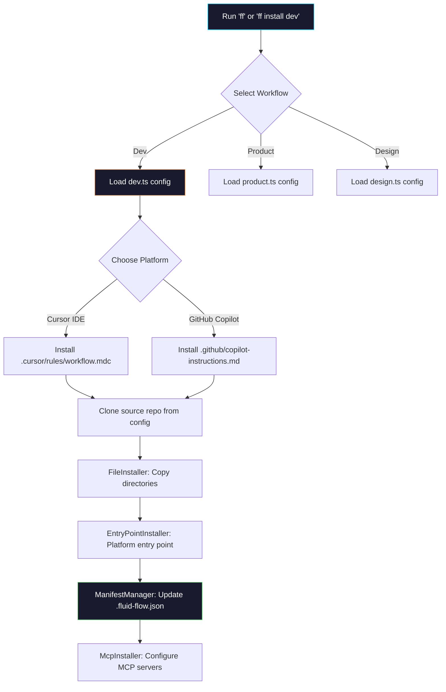
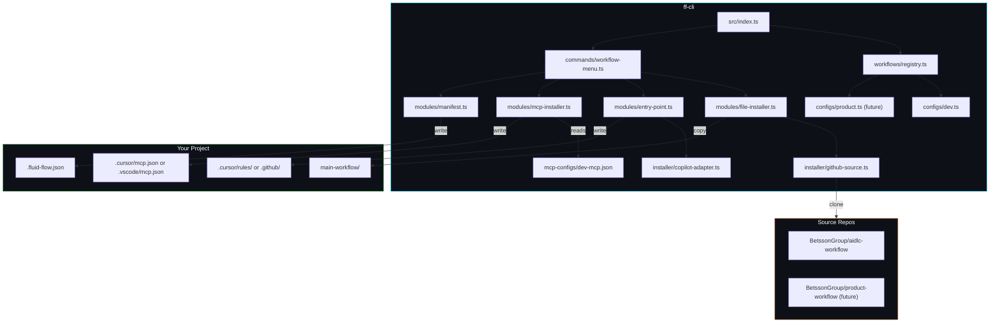

# Fluid Flow CLI

> Multi-workflow orchestration tool for Cursor IDE and GitHub Copilot.

Fluid Flow CLI (`ff`) installs, updates, and manages multiple **workflow systems** in your repositories. Each workflow is independently configurable and pulls files from its own source repository. The CLI supports a modular, configuration-driven architecture where adding a new workflow requires only a config file -- no new code.

---

## Table of Contents

- [Quick Start](#quick-start)
- [Prerequisites](#prerequisites)
- [Installation](#installation)
  - [macOS / Linux](#macos--linux)
  - [Windows](#windows)
  - [Manual Install (Any OS)](#manual-install-any-os)
- [Available Workflows](#available-workflows)
- [Usage](#usage)
  - [Interactive Mode](#interactive-mode)
  - [CLI Commands](#cli-commands)
- [Commands Reference](#commands-reference)
  - [install](#install)
  - [update](#update)
  - [verify](#verify)
  - [mcp](#mcp)
  - [workflows](#workflows)
- [How It Works](#how-it-works)
- [Adding a New Workflow](#adding-a-new-workflow)
- [Supported Platforms](#supported-platforms)
- [Configuration Files](#configuration-files)
- [Troubleshooting](#troubleshooting)
- [Uninstalling](#uninstalling)
- [Architecture](#architecture)

---

## Quick Start

> **Note:** This is a private BetssonGroup repository. You need [GitHub CLI](https://cli.github.com/) (`gh`) authenticated with access to `BetssonGroup/cdl-ff-cli`.

**macOS / Linux:**

```bash
gh api repos/BetssonGroup/cdl-ff-cli/contents/install.sh -H "Accept:application/vnd.github.raw" | bash
cd /path/to/your-project
ff
```

**Windows (PowerShell):**

```powershell
gh api repos/BetssonGroup/cdl-ff-cli/contents/install.ps1 -H "Accept:application/vnd.github.raw" | iex
cd C:\path\to\your-project
ff
```

That's it. The interactive menu guides you through everything.

---

## Prerequisites

| Requirement | Version | Check Command | Install |
|------------|---------|---------------|---------|
| **Node.js** | >= 20.0.0 | `node --version` | [nodejs.org](https://nodejs.org/) |
| **Git** | any recent | `git --version` | [git-scm.com](https://git-scm.com/) |
| **GitHub CLI** | any recent | `gh --version` | [cli.github.com](https://cli.github.com/) — **required** |

> **GitHub CLI is required** because this is a private repository. The `gh` CLI handles authentication automatically for cloning and downloading.

### Installing Prerequisites

<details>
<summary><strong>macOS</strong></summary>

```bash
# Node.js (via Homebrew)
brew install node@20

# Git (usually pre-installed, or via Homebrew)
brew install git

# GitHub CLI (required)
brew install gh
gh auth login
```

</details>

<details>
<summary><strong>Windows</strong></summary>

```powershell
# Node.js (via winget)
winget install OpenJS.NodeJS.LTS

# Git (via winget)
winget install Git.Git

# GitHub CLI (required)
winget install GitHub.cli
gh auth login
```

Or download installers directly:
- Node.js: [nodejs.org/en/download](https://nodejs.org/en/download/)
- Git: [git-scm.com/download/win](https://git-scm.com/download/win)
- GitHub CLI: [cli.github.com](https://cli.github.com/)

> **Note:** After installing via installers, you may need to restart your terminal for the commands to be available.

</details>

<details>
<summary><strong>Linux</strong></summary>

```bash
# Node.js (via NodeSource or nvm)
curl -fsSL https://deb.nodesource.com/setup_20.x | sudo -E bash -
sudo apt-get install -y nodejs

# Git (usually pre-installed, or via package manager)
sudo apt-get install -y git          # Debian/Ubuntu
# sudo dnf install -y git            # Fedora/RHEL

# GitHub CLI (required)
# Debian/Ubuntu:
(type -p wget >/dev/null || sudo apt-get install wget -y) \
  && sudo mkdir -p -m 755 /etc/apt/keyrings \
  && out=$(mktemp) && wget -nv -O$out https://cli.github.com/packages/githubcli-archive-keyring.gpg \
  && cat $out | sudo tee /etc/apt/keyrings/githubcli-archive-keyring.gpg > /dev/null \
  && sudo chmod go+r /etc/apt/keyrings/githubcli-archive-keyring.gpg \
  && echo "deb [arch=$(dpkg --print-architecture) signed-by=/etc/apt/keyrings/githubcli-archive-keyring.gpg] https://cli.github.com/packages stable main" | sudo tee /etc/apt/sources.list.d/github-cli.list > /dev/null \
  && sudo apt-get update \
  && sudo apt-get install gh -y

# Fedora/RHEL:
# sudo dnf install gh -y

gh auth login
```

</details>

### GitHub CLI Authentication

Authenticate with your GitHub account that has access to BetssonGroup:

```bash
gh auth login
```

Verify you have access to the repository:

```bash
gh repo view BetssonGroup/cdl-ff-cli
```

---

## Installation

### macOS / Linux

**One-line install:**

```bash
gh api repos/BetssonGroup/cdl-ff-cli/contents/install.sh -H "Accept:application/vnd.github.raw" | bash
```

This script will:
1. Verify Node.js >= 20, Git, npm, and GitHub CLI are installed and authenticated
2. Verify access to `BetssonGroup/cdl-ff-cli`
3. Clone the repository to `~/.ff-cli` using `gh`
4. Install dependencies (`npm install`)
5. Build the TypeScript source (`npm run build`)
6. Link the CLI globally (`npm link`) — makes `ff` and `fluidflow` available everywhere
7. Verify the installation

**Re-running the script updates to the latest version** (it's idempotent).

### Windows

**One-line install (PowerShell):**

```powershell
gh api repos/BetssonGroup/cdl-ff-cli/contents/install.ps1 -H "Accept:application/vnd.github.raw" | iex
```

> **Execution policy:** If you get an execution policy error, run this first:
> ```powershell
> Set-ExecutionPolicy -Scope CurrentUser -ExecutionPolicy RemoteSigned
> ```

This script will:
1. Verify Node.js >= 20, Git, npm, and GitHub CLI are installed and authenticated
2. Verify access to `BetssonGroup/cdl-ff-cli`
3. Clone the repository to `%USERPROFILE%\.ff-cli` using `gh`
4. Install dependencies (`npm install`)
5. Build the TypeScript source (`npm run build`)
6. Link the CLI globally (`npm link`) — makes `ff` and `fluidflow` available everywhere
7. Verify the installation

**Re-running the script updates to the latest version** (it's idempotent).

### Manual Install (Any OS)

Works on macOS, Linux, and Windows:

```bash
# 1. Clone the repository (uses gh for authenticated access)
gh repo clone BetssonGroup/cdl-ff-cli ~/.ff-cli

# 2. Install dependencies
cd ~/.ff-cli
npm install

# 3. Build the project
npm run build

# 4. Link globally (makes 'ff' and 'fluidflow' commands available)
npm link

# 5. Verify
ff --version
```

> **Windows note:** Replace `~/.ff-cli` with `%USERPROFILE%\.ff-cli` if your shell doesn't expand `~`.

### Install from a Specific Branch

```bash
gh repo clone BetssonGroup/cdl-ff-cli ~/.ff-cli -- --branch <branch-name>
cd ~/.ff-cli && npm install && npm run build && npm link
```

---

## Available Workflows

| Workflow | ID | Source Repository | Description |
|----------|----|-------------------|-------------|
| **Development Workflow** | `dev` | `BetssonGroup/aidlc-workflow` | AI-powered development lifecycle orchestration |

> More workflows (Product, Design, etc.) can be added by creating configuration files. See [Adding a New Workflow](#adding-a-new-workflow).

---

## Usage

### Interactive Mode

Launch the full interactive experience by running `ff` with no arguments:

```bash
ff
```

This opens a workflow-selection menu:

```
  +-- Main Menu ------------------------------------------------+
  |                                                              |
  |  1. Development Workflow   AI-powered development lifecycle  |
  |  2. Status                 Check all installed workflows     |
  |  3. Exit                   Quit Fluid Flow CLI               |
  |                                                              |
  +--------------------------------------------------------------+
```

Selecting a workflow opens its sub-menu with all available actions:

```
  +-- Development Workflow -------------------------------------+
  |                                                              |
  |  1. Install      Install Development Workflow                |
  |  2. Update       Update to the latest version                |
  |  3. Verify       Check GitHub for changes & show diff        |
  |  4. MCP Setup    Configure MCP servers                       |
  |  5. Status       Check installation status                   |
  |  6. Back         Return to main menu                         |
  |                                                              |
  +--------------------------------------------------------------+
```

### CLI Commands

For scripting or quick actions, use commands directly:

```bash
ff [command] [workflow] [options]
```

| Command | Description |
|---------|-------------|
| `ff` | Launch the interactive menu |
| `ff dev` | Open the dev workflow sub-menu directly |
| `ff install dev` | Install the dev workflow into a repository |
| `ff update dev` | Update the dev workflow to the latest version |
| `ff verify` | Check for upstream changes and show diff |
| `ff mcp dev` | Configure MCP servers for the dev workflow |
| `ff workflows` | List all available workflows and their status |
| `ff version` | Show CLI version |
| `ff help` | Show help message |

---

## Commands Reference

### install

Install a workflow into a target repository.

```bash
# Install dev workflow (prompts for platform and directory)
ff install dev

# Install for Cursor IDE in current directory
ff install dev --target cursor

# Install for GitHub Copilot in current directory
ff install dev --target copilot

# Install in a specific directory
ff install dev /path/to/repo -t cursor

# Force reinstall
ff install dev --force
```

**What it does:**
1. Clones the latest workflow files from the workflow's source repository
2. Copies the configured directories into your project
3. Installs platform-specific entry points:
   - **Cursor IDE**: `.cursor/rules/workflow.mdc` -- activates automatically
   - **GitHub Copilot**: `.github/copilot-instructions.md` + `.github/instructions/*.instructions.md`
4. Updates the `.fluid-flow.json` manifest to track the installation
5. Optionally configures MCP servers

**After installation:**
- **Cursor**: Open the project in Cursor -- the workflow rule activates automatically when you make development requests
- **Copilot**: Instructions are loaded automatically by GitHub Copilot

### update

Update an existing workflow installation to the latest version.

```bash
# Update the dev workflow
ff update dev

# Check for updates without applying
ff update dev --check

# Force re-download even if up to date
ff update dev --force
```

### verify

Check for upstream changes in the workflow repository and show what has changed since your installation.

```bash
# Verify current directory
ff verify

# Verify a specific repository
ff verify /path/to/repo
```

**Shows:**
- Commit history since your installed version
- File-level diff summary (added, modified, removed files)
- Link to GitHub comparison view

### mcp

Configure Model Context Protocol (MCP) servers for a specific workflow.

```bash
# Interactive MCP setup for dev workflow
ff mcp dev

# Setup for Cursor only
ff mcp dev -t cursor

# Setup for VS Code / Copilot only
ff mcp dev -t copilot

# Setup for both platforms
ff mcp dev -t both

# Force overwrite existing entries
ff mcp dev --force
```

Each workflow has its own MCP server configuration file (e.g., `mcp-configs/dev-mcp.json`). MCP servers included in the dev workflow:

| Server | Runtime | Default State |
|--------|---------|---------------|
| Atlassian (Jira/Confluence) | Node.js | Enabled |
| GitHub | Node.js | Enabled |
| Filesystem | Node.js | Enabled |
| Web Search | Node.js | Disabled |
| AWS Document Loader | Python/uv | Enabled |

The setup wizard analyzes your existing configuration before making changes and never overwrites user-defined servers.

### workflows

List all available workflows and their installation status.

```bash
ff workflows
```

**Shows:**
- All registered workflows with their IDs and descriptions
- Whether each workflow is installed in the current directory

---

## How It Works



The CLI is **configuration-driven**: each workflow is defined by a `WorkflowConfig` object that specifies the source repository, directories to install, entry points, and MCP servers. The reusable modules (`FileInstaller`, `EntryPointInstaller`, `McpInstaller`, `ManifestManager`) read this config at runtime, so no code changes are needed to add a new workflow.

---

## Adding a New Workflow

Adding a new workflow requires **only configuration files**, no new code:

### Step 1: Create the workflow config

Create `src/workflows/configs/<id>.ts`:

```typescript
import type { WorkflowConfig } from "../types.js";

export const productWorkflow: WorkflowConfig = {
  id: "product",
  name: "Product Workflow",
  description: "Product management and planning orchestration",

  source: {
    owner: "BetssonGroup",
    repo: "product-workflow",      // the GitHub repo to pull from
    branch: "main",
  },

  install: {
    directories: ["product-workflow"],  // directories to copy
    entryPoints: {
      cursor: {
        source: ".cursor/rules/product.mdc",
        target: ".cursor/rules/product.mdc",
      },
      copilot: {
        source: ".cursor/rules/product.mdc",
        target: ".github/product-instructions.md",
        transform: "copilot",
      },
    },
    executableExtensions: [".sh"],
  },

  mcp: {
    configFile: "mcp-configs/product-mcp.json",
  },

  features: ["install", "update", "verify", "mcp"],
};
```

### Step 2: Create the MCP config (if needed)

Create `mcp-configs/product-mcp.json` with the MCP server definitions specific to this workflow.

### Step 3: Register the workflow

Add the import to `src/workflows/registry.ts`:

```typescript
import { devWorkflow } from "./configs/dev.js";
import { productWorkflow } from "./configs/product.js";

const ALL_WORKFLOWS: WorkflowConfig[] = [
  devWorkflow,
  productWorkflow,    // <-- add here
];
```

### Step 4: Build

```bash
npm run build
```

The new workflow automatically appears in the interactive menu and CLI commands (`ff install product`, `ff mcp product`, etc.).

---

## Supported Platforms

### Cursor IDE

- Entry point: `.cursor/rules/workflow.mdc`
- Activation: Automatic — Cursor reads `.mdc` rule files on project open
- Workflow triggers when you make a development request in Cursor's AI chat

### GitHub Copilot

- Entry point: `.github/copilot-instructions.md`
- Additional: `.github/instructions/*.instructions.md` (path-specific instructions)
- Activation: Automatic — Copilot reads instruction files from `.github/`
- Includes Copilot-specific adaptations (YAML frontmatter stripped, format transformed)

---

## Configuration Files

### In your project (target repository)

| File | Purpose | Git-track? |
|------|---------|------------|
| `main-workflow/` | Dev workflow files installed in your project | Yes |
| `.cursor/rules/workflow.mdc` | Cursor IDE entry point | Yes |
| `.github/copilot-instructions.md` | Copilot entry point | Yes |
| `.fluid-flow.json` | Multi-workflow manifest (tracks all installed workflows) | Optional |

> **Tip:** Add `.fluid-flow.json` to your `.gitignore` if you don't want to track installation metadata.

### Manifest format (v2)

The `.fluid-flow.json` manifest supports multiple workflows:

```json
{
  "version": 2,
  "workflows": {
    "dev": {
      "platform": "cursor",
      "commitSha": "abc1234...",
      "branch": "main",
      "sourceRepo": "BetssonGroup/aidlc-workflow",
      "installedAt": "2025-01-15T10:30:00.000Z",
      "updatedAt": "2025-01-20T14:00:00.000Z",
      "installedPaths": ["main-workflow", ".cursor/rules/workflow.mdc"]
    }
  }
}
```

Legacy v1 manifests (single-workflow) are automatically migrated to v2 format.

### In the CLI repository (ff-cli)

| File | Purpose |
|------|---------|
| `src/workflows/configs/dev.ts` | Dev workflow configuration |
| `mcp-configs/dev-mcp.json` | MCP server definitions for dev workflow |
| `src/workflows/types.ts` | Shared type definitions |
| `src/workflows/registry.ts` | Workflow registry (imports all configs) |

---

## Troubleshooting

### "Command not found: ff"

<details>
<summary><strong>macOS / Linux</strong></summary>

The global link may not be in your PATH:

```bash
# Check where npm links binaries
npm prefix -g

# Verify the link exists
ls -la $(npm prefix -g)/bin/ff
```

If using `nvm`, ensure your Node.js version is >= 20 and re-run `npm link`:

```bash
nvm use 20
cd ~/.ff-cli && npm link
```

If the issue persists, add the npm global bin to your PATH:

```bash
# Add to ~/.zshrc or ~/.bashrc
export PATH="$(npm prefix -g)/bin:$PATH"
```

Then reload your shell:

```bash
source ~/.zshrc   # or source ~/.bashrc
```

</details>

<details>
<summary><strong>Windows</strong></summary>

The npm global directory may not be in your PATH:

```powershell
# Check where npm links binaries
npm prefix -g

# Verify ff exists
Test-Path "$(npm prefix -g)\ff.cmd"
```

Add the npm global directory to your PATH permanently:

```powershell
# Run in an elevated (Administrator) PowerShell
$npmBin = npm prefix -g
[Environment]::SetEnvironmentVariable('PATH', $env:PATH + ";$npmBin", 'User')
```

Then restart your terminal.

If using `nvm-windows`, ensure your Node.js version is >= 20:

```powershell
nvm use 20
cd $env:USERPROFILE\.ff-cli
npm link
```

</details>

### "Failed to clone BetssonGroup/aidlc-workflow"

This means the CLI can't access the workflow source repository. Solutions:

1. **Authenticate with GitHub CLI:**
   ```bash
   gh auth login
   ```

2. **Verify repository access:**
   ```bash
   gh repo view BetssonGroup/aidlc-workflow
   ```

3. **Check Git SSH/HTTPS configuration:**
   ```bash
   git ls-remote https://github.com/BetssonGroup/aidlc-workflow.git
   ```

### "Cannot access BetssonGroup/cdl-ff-cli"

You need to be a member of the BetssonGroup GitHub organization with access to this repository. Contact your team lead or GitHub admin to request access.

### "Node.js version too old"

The CLI requires Node.js >= 20.0.0:

**macOS / Linux:**
```bash
node --version
nvm install 20
nvm use 20
```

**Windows:**
```powershell
node --version
# Download latest LTS from https://nodejs.org/
# Or use nvm-windows: nvm install 20 && nvm use 20
```

### Execution Policy Error (Windows)

If PowerShell blocks the install script:

```powershell
Set-ExecutionPolicy -Scope CurrentUser -ExecutionPolicy RemoteSigned
```

Then re-run the install command.

### Build Errors

If TypeScript compilation fails:

**macOS / Linux:**
```bash
cd ~/.ff-cli
rm -rf dist node_modules
npm install
npm run build
```

**Windows:**
```powershell
cd $env:USERPROFILE\.ff-cli
Remove-Item -Recurse -Force dist, node_modules -ErrorAction SilentlyContinue
npm install
npm run build
```

---

## Uninstalling

### Remove the CLI

**macOS / Linux:**
```bash
cd ~/.ff-cli && npm unlink -g
rm -rf ~/.ff-cli
```

**Windows (PowerShell):**
```powershell
Push-Location $env:USERPROFILE\.ff-cli
npm unlink -g
Pop-Location
Remove-Item -Recurse -Force $env:USERPROFILE\.ff-cli
```

### Remove Fluid Flow from a Project

Remove the installed workflow files from a specific project:

**macOS / Linux:**
```bash
rm -rf main-workflow/
rm -f .fluid-flow.json
rm -f .cursor/rules/workflow.mdc          # Cursor
rm -f .github/copilot-instructions.md     # Copilot
rm -rf .github/instructions/              # Copilot instruction files
```

**Windows (PowerShell):**
```powershell
Remove-Item -Recurse -Force main-workflow -ErrorAction SilentlyContinue
Remove-Item -Force .fluid-flow.json -ErrorAction SilentlyContinue
Remove-Item -Force .cursor\rules\workflow.mdc -ErrorAction SilentlyContinue
Remove-Item -Force .github\copilot-instructions.md -ErrorAction SilentlyContinue
Remove-Item -Recurse -Force .github\instructions -ErrorAction SilentlyContinue
```

---

## Updating the CLI Itself

**macOS / Linux:**
```bash
# Option A: Re-run the install script
gh api repos/BetssonGroup/cdl-ff-cli/contents/install.sh -H "Accept:application/vnd.github.raw" | bash

# Option B: Manual update
cd ~/.ff-cli && git pull origin main && npm install && npm run build
```

**Windows (PowerShell):**
```powershell
# Option A: Re-run the install script
gh api repos/BetssonGroup/cdl-ff-cli/contents/install.ps1 -H "Accept:application/vnd.github.raw" | iex

# Option B: Manual update
cd $env:USERPROFILE\.ff-cli; git pull origin main; npm install; npm run build
```

---

## Architecture



### Project Structure

```
ff-cli/
├── bin/
│   └── ff.js                      # Entry point (#!/usr/bin/env node)
├── mcp-configs/
│   └── dev-mcp.json               # MCP server definitions for dev workflow
├── src/
│   ├── index.ts                   # Main CLI — dynamic multi-workflow menu
│   ├── workflows/
│   │   ├── types.ts               # WorkflowConfig, Platform, manifest types
│   │   ├── registry.ts            # Central registry of all workflow configs
│   │   └── configs/
│   │       └── dev.ts             # Development workflow configuration
│   ├── modules/
│   │   ├── file-installer.ts      # Generic file copy from source to target
│   │   ├── entry-point.ts         # Platform-specific entry point installer
│   │   ├── mcp-installer.ts       # MCP setup (reads from JSON config files)
│   │   └── manifest.ts            # Multi-workflow manifest (v2) manager
│   ├── commands/
│   │   ├── workflow-menu.ts       # Per-workflow sub-menu (Install/Update/Verify/MCP)
│   │   ├── install.ts             # CLI: ff install <workflow> [options]
│   │   ├── update.ts              # CLI: ff update <workflow> [options]
│   │   ├── verify.ts              # CLI: ff verify [target-dir]
│   │   ├── mcp-setup.ts           # CLI: ff mcp <workflow> [options]
│   │   └── registry.ts            # REPL command registry
│   ├── installer/
│   │   ├── index.ts               # Legacy install/update orchestration
│   │   ├── github-source.ts       # GitHub repo cloning (parameterized per workflow)
│   │   ├── manifest.ts            # Legacy v1 manifest (kept for compat)
│   │   ├── mcp-setup.ts           # MCP setup infrastructure (builders, prereqs)
│   │   ├── file-ops.ts            # File system operations
│   │   └── copilot-adapter.ts     # Copilot-specific transformations
│   ├── ui/
│   │   ├── theme.ts               # Colors and styling
│   │   ├── welcome.ts             # Welcome banner
│   │   ├── menu.ts                # Interactive menus
│   │   ├── prompt.ts              # User prompts
│   │   ├── box.ts                 # Box rendering
│   │   ├── statusBar.ts           # Status bar
│   │   └── ascii.ts               # ASCII art
│   └── utils/
│       └── system.ts              # System utilities
├── package.json
├── tsconfig.json
├── install.sh                     # One-line installer (macOS / Linux)
└── install.ps1                    # One-line installer (Windows)
```

### Tech Stack

| Component | Technology |
|-----------|-----------|
| Language | TypeScript (ES2022) |
| Runtime | Node.js >= 20 |
| Module System | ES Modules (NodeNext) |
| Terminal Colors | [chalk](https://github.com/chalk/chalk) v5 |
| Source Control | GitHub CLI (`gh`) + Git |
| Platforms | macOS, Windows, Linux |

---

## License

MIT
