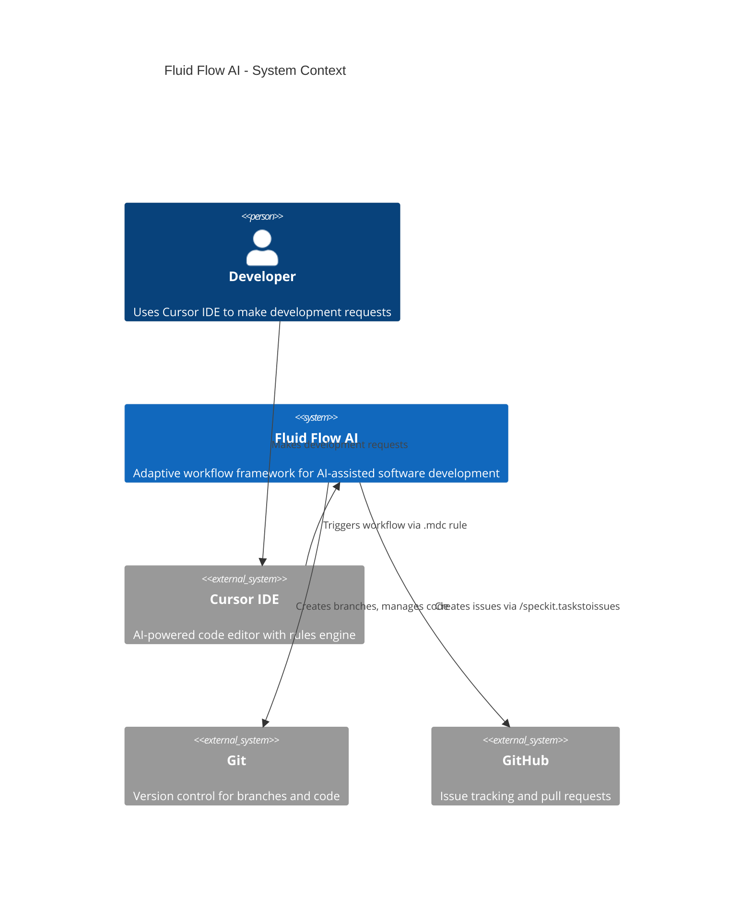
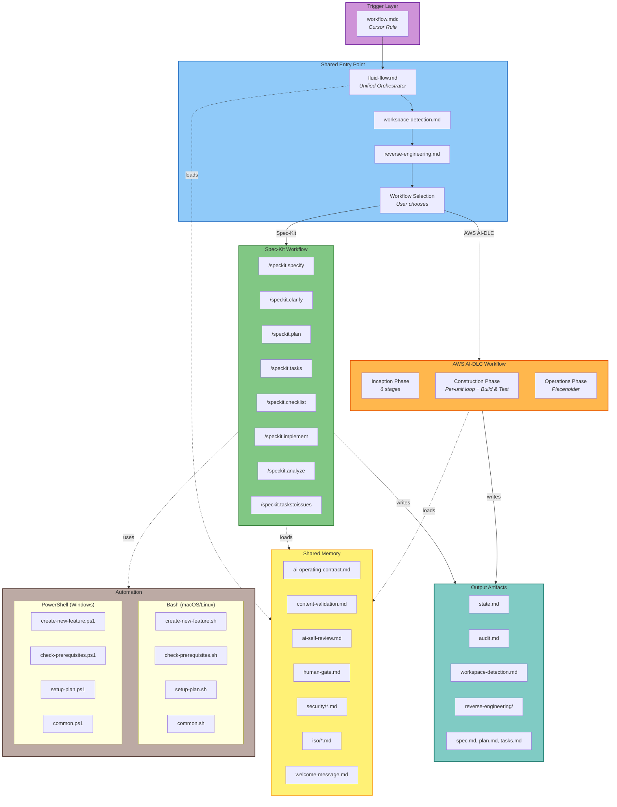
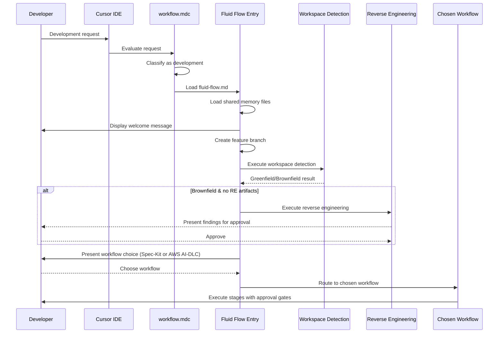

# Architecture

This document describes the internal architecture of Fluid Flow AI -- how its components relate to each other, how data flows through the system, and the design decisions behind the framework.

---

## System Overview

Fluid Flow AI is a layered workflow framework. At the top sits a Cursor IDE rule that intercepts every development request. That rule loads a unified entry point which orchestrates shared stages, then routes to one of two workflow engines. Both engines share a common governance backbone.

---

## Component Architecture

---

## Layers

### 1. Trigger Layer

The `workflow.mdc` Cursor rule is the gateway. It has `alwaysApply: true`, meaning it evaluates on every user message. It classifies the request:

- **Development request** (new feature, bug fix, infrastructure change, etc.) --> activates the workflow
- **Non-development request** (question, discussion) --> responds normally without the workflow

When activated, it displays a visible confirmation banner and immediately loads the unified entry point.

### 2. Shared Entry Point

`fluid-flow.md` is the orchestrator. It executes stages in sequence:

| Stage | Condition | Purpose |
|-------|-----------|---------|
| Shell Detection | Always | Detect Bash vs PowerShell environment for script invocations |
| Branch Creation | Always | Create `###-jira-ticket-short-description` branch and `specs/{BRANCH_NAME}/` directory |
| Workspace Detection | Always | Scan for existing code, determine greenfield/brownfield |
| Reverse Engineering | Brownfield, run-once | Generate comprehensive architecture documentation |
| Workflow Selection | Always | Present both workflows and let the user choose directly |
| Workflow Routing | Always | Route to the chosen workflow engine |

### 3. Shared Memory

Memory files are loaded at workflow start and referenced throughout execution. They define the rules of engagement:

| Category | Files | Purpose |
|----------|-------|---------|
| **Operating Contract** | `ai-operating-contract.md` | Defines AI role, decision authority, overconfidence guardrail |
| **Overconfidence Prevention** | `overconfidence-prevention.md` | Prevents confidence without evidence, question generation philosophy |
| **Content Validation** | `content-validation.md` | Mermaid validation, character escaping, fallback rules |
| **Review Gates** | `ai-self-review.md`, `human-gate.md` | Self-review checklist, human approval requirements |
| **Architecture** | `architecture/adr-integrity-gate.md` | ADR identification, compliance checking, extension rules |
| **Continuous Learning** | `meta/continuous-learning.md` | Systemic issue detection, rule/ADR improvement proposals |
| **Security** | `security/*.md` | ISO 27001, threat modelling, secrets, network boundaries, data classification |
| **Quality** | `iso/iso9001-quality-management.md` | Process discipline, traceability, continuous improvement |
| **Energy** | `iso/iso50001-energy-management.md` | Energy management for infrastructure-related work |

### 4. Workflow Engines

#### Spec-Kit

A linear, command-driven pipeline. Each command is a standalone `.md` file that loads shared memory, executes its logic, and produces artifacts in `specs/{BRANCH_NAME}/`.

#### AWS AI-DLC

A phase-based engine with adaptive depth. Stages are conditional -- the AI assesses what is needed based on complexity, scope, and risk. The Construction phase uses a per-unit loop where each unit of work goes through design, NFR assessment, infrastructure design, and code generation before the next unit starts.

### 5. Automation Scripts

Shell scripts handle mechanical tasks. Both Bash and PowerShell versions are provided for cross-OS support. The workflow auto-detects the shell environment (see `shell-detection.md`) and invokes the correct variant.

| Script (Bash / PowerShell) | Purpose |
|----------------------------|---------|
| `create-new-feature.sh` / `.ps1` | Creates numbered branches, initialises feature directories |
| `check-prerequisites.sh` / `.ps1` | Validates feature context exists before commands run |
| `setup-plan.sh` / `.ps1` | Prepares plan template and context for planning commands |
| `update-agent-context.sh` / `.ps1` | Updates AI agent context files from plan data |
| `common.sh` / `.ps1` | Shared utilities for the other scripts |

### 6. Output Artifacts

All artifacts are written to `specs/`:

- **Feature-level**: `specs/{BRANCH_NAME}/` -- state, audit, workspace detection, specifications, plans, tasks, design documents
- **Project-level**: `specs/_project/` -- reverse engineering artifacts shared across features

Application code is always written to the workspace root, never to `specs/`.

---

## Data Flow

---

## State Management

### Feature State (`state.md`)

Each feature has a `state.md` file that tracks:
- Feature information (branch name, creation date, current stage, selected workflow)
- Entry point progress (checkboxes for each shared stage)
- Workspace state (project type, brownfield status, workspace root)
- Workflow progress (populated by the chosen workflow)

### Audit Trail (`audit.md`)

Each feature has an `audit.md` file that records:
- Every user input (complete raw text, never summarised)
- Every AI response and action taken
- Every approval prompt and user response
- ISO 8601 timestamps for all entries
- Stage context for each entry

The audit file is **append-only** -- it must never be overwritten, only appended to.

---

## Design Decisions

### Why Two Workflow Paths?

Not every feature needs a full enterprise SDLC. Simple bug fixes, CRUD operations, and well-scoped enhancements benefit from a lightweight pipeline. Complex infrastructure changes, multi-service integrations, and work requiring ADRs need comprehensive design phases. The dual-path approach keeps simple work efficient while ensuring complex work gets proper treatment.

### Why Run-Once Reverse Engineering?

Full codebase analysis is expensive in terms of context window usage. Running it once per project and updating incrementally after each implementation keeps the cost manageable while maintaining accurate architectural documentation.

### Why Shared Memory Files?

Centralising governance rules (security, quality, review gates) ensures both workflow paths enforce the same standards. Changes to governance rules propagate automatically to both paths.

### Why Mandatory Approval Gates?

The AI Operating Contract establishes that AI proposes and humans decide. Approval gates enforce this contract by requiring explicit human confirmation before proceeding at each critical stage.
