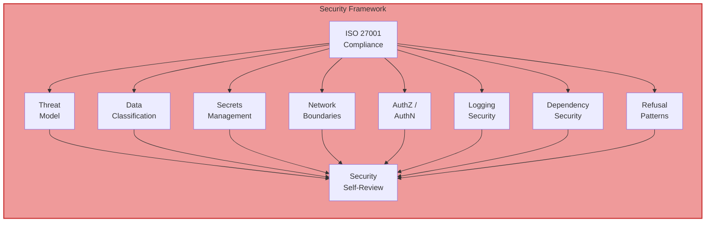

# Governance, Compliance & Security

This document describes the governance framework that underpins both workflow paths in Fluid Flow AI. It covers the AI operating contract, compliance standards, security rules, review gates, and audit requirements.

---

## Table of Contents

- [AI Operating Contract](#ai-operating-contract)
- [Review Gates](#review-gates)
- [ISO Compliance](#iso-compliance)
- [Security Framework](#security-framework)
- [Content Validation](#content-validation)
- [Audit Trail Requirements](#audit-trail-requirements)

---

## AI Operating Contract

The AI Operating Contract defines the boundaries of AI participation in the development lifecycle.

### AI Role

The AI acts as a **non-accountable engineering assistant**. It is a participant in the delivery lifecycle, but never the decision-maker.

### What AI May Do

- Analyse requirements
- Propose designs, implementations, and alternatives
- Generate code and documentation
- Identify risks, trade-offs, and alternatives

### What AI Must Never Do

- Make architectural decisions silently
- Make compliance, security, or regulatory decisions
- Assume jurisdictional, legal, or data-handling constraints
- Override existing ADRs or Technical Principles
- Self-approve its own output

### Decision Authority

> **AI proposes. Humans decide.**

AI documents decisions and assumptions explicitly. If uncertainty exists, AI must stop and request clarification. Confidence without evidence is not allowed.

### Overconfidence Guardrail

If the AI is not certain about something, it must say so explicitly. This prevents the AI from presenting assumptions as facts or making decisions that should be escalated to humans.

---

## Review Gates

Fluid Flow AI enforces two types of review gates at every critical stage.

### AI Self-Review Gate

Before finalising any output, the AI must explicitly answer:

| Category | Questions |
|----------|-----------|
| **Correctness** | What assumptions were made? What could break? |
| **Risk** | Operational risk? Security risk? Compliance or regulatory risk? |
| **Operability** | Observability expectations? Failure modes? Rollback strategy? |
| **Scope Control** | What was intentionally NOT changed? Why do those boundaries exist? |

The AI must **never** conclude with "looks good" or equivalent self-approval statements.

### Human Approval Gate

AI must clearly separate actions into two categories:

**Requires Human Approval**:
- Architecture changes
- ADR changes
- Security model changes
- Compliance or jurisdictional implications
- Data retention or personal data handling

**Safe to Proceed** (without explicit approval):
- Refactoring within existing patterns
- Code quality improvements
- Test additions
- Documentation updates

### Mandatory Stop Conditions

The AI must stop and request clarification if:
- Jurisdiction is unknown
- Regulatory scope is unclear
- ADRs are missing, ambiguous, or conflicting
- Requirements contradict technical principles
- Cross-domain or cross-platform changes are implied

Proceeding under uncertainty is not allowed.

### ADR Integrity Gate

All architectural decisions must be evaluated against existing Architecture Decision Records (ADRs). For each relevant ADR, the AI must state whether the solution complies, extends, or violates it. If an ADR must be extended or violated, the AI must propose an update and escalate for human approval. Implementation does not proceed until the conflict is resolved.

**File**: `main-workflow/workflows/shared/memory/architecture/adr-integrity-gate.md`

### Continuous Learning

If repeated friction, workarounds, or conflicts are detected, the AI must highlight systemic issues, propose updates to ADRs, principles, or rules, and avoid repeating known suboptimal patterns.

**File**: `main-workflow/workflows/shared/memory/meta/continuous-learning.md`

---

## ISO Compliance

Fluid Flow AI incorporates three ISO standards into its governance backbone.

### ISO 27001 -- Information Security Management

**Applicability**: Mandatory when changes affect security, data, identity, or infrastructure.

**Key areas covered**:

| Area | Description |
|------|-------------|
| **Access Control** | Authentication and authorisation rules (`authz-authn.md`) |
| **Data Classification** | Data sensitivity levels and handling rules (`data-classification.md`) |
| **Secrets Management** | How secrets are stored, rotated, and accessed (`secrets-management.md`) |
| **Network Boundaries** | Network segmentation and perimeter rules (`network-boundaries.md`) |
| **Logging Security** | Audit logging requirements and protections (`logging-security.md`) |
| **Dependencies** | Third-party dependency security assessment (`dependencies.md`) |
| **Threat Model** | Threat modelling approach and requirements (`threat-model.md`) |
| **Refusal Patterns** | When and how to refuse unsafe operations (`refusal-patterns.md`) |
| **Security Self-Review** | Security-specific review checklist (`security-self-review.md`) |

### ISO 9001 -- Quality Management

**Applicability**: Mandatory for all software delivery.

**Principles enforced**:
- Process discipline -- follow defined workflows, do not skip stages
- Traceability -- every decision traced from requirement to implementation
- Validation -- verify outputs meet requirements at each stage
- Continuous improvement -- identify and propose improvements to processes
- Quality objectives -- define measurable quality targets

### ISO 50001 -- Energy Management

**Applicability**: Mandatory for infrastructure, performance, or Significant Energy Use (SEU)-related work.

**When applied**:
- Infrastructure provisioning or changes
- Performance optimisation work
- Cloud resource specification
- Systems identified as SEUs

---

## Security Framework

The security framework is structured as a collection of memory files loaded when changes affect security, data, identity, or infrastructure.



### ADR Enforcement (AWS AI-DLC)

In the AWS AI-DLC workflow, all architectural decisions are evaluated against existing Architecture Decision Records (ADRs):

1. For each relevant ADR, the AI states whether the solution **complies**, **extends**, or **violates** it
2. If an ADR must be extended or violated, the AI proposes an ADR update and escalates for human approval
3. Implementation does not proceed until the ADR conflict is resolved

---

## Content Validation

All generated content must be validated before writing to files.

### Mermaid Diagram Rules

- **Always use Mermaid** for all diagrams (flowcharts, sequence diagrams, architecture, etc.)
- **Never use ASCII art**, box-drawing characters, or plain-text diagrams
- Validate syntax before file creation
- Escape special characters in labels
- Use alphanumeric + underscore for node IDs
- Provide a brief text alternative alongside Mermaid diagrams, especially in user-facing documentation

### Pre-Creation Validation Checklist

- [ ] Validate embedded code blocks (Mermaid, JSON, YAML)
- [ ] Check special character escaping
- [ ] Verify markdown syntax correctness
- [ ] Test content parsing compatibility
- [ ] Include fallback content for complex elements

### Validation Failure Handling

1. Log the error
2. Use fallback (text-based) content
3. Continue workflow (do not block on validation failures)
4. Inform user that simplified content was used

---

## Audit Trail Requirements

### What Must Be Logged

| Item | Requirement |
|------|-------------|
| Every user input | Complete raw text -- never summarised or paraphrased |
| Every AI response | Action taken and context |
| Every approval prompt | Logged before asking the user |
| Every user response | Logged after receiving it |
| Stage transitions | Start and completion of each stage |
| Decision points | Workflow selection, stage approvals, user choices |

### Logging Format

```markdown
## [Stage Name or Interaction Type]
**Timestamp**: [ISO 8601 timestamp]
**User Input**: "[Complete raw user input - never summarized]"
**AI Response**: "[AI's response or action taken]"
**Context**: [Stage, action, or decision made]

---
```

### Logging Rules

| Rule | Description |
|------|-------------|
| **Append-only** | Audit files must never be overwritten -- only appended to |
| **ISO 8601 timestamps** | All timestamps in `YYYY-MM-DDTHH:MM:SSZ` format |
| **Verbatim capture** | User input must be captured exactly as provided |
| **Stage context** | Every entry must include the current stage context |
| **No summarisation** | Raw input is never condensed or paraphrased |

### Correct Tool Usage

The audit file (`audit.md`) must be modified by reading and then appending/editing -- never by reading and then completely overwriting with the old content plus new additions. This prevents data loss from truncation or context window limitations.
