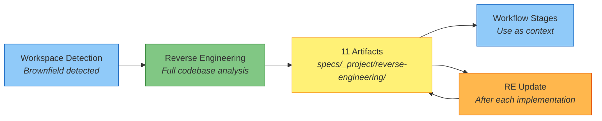

# Reverse Engineering

This document describes the reverse engineering process in Fluid Flow AI -- what it does, when it runs, and the artifacts it generates in `specs/_project/reverse-engineering/`.

---

## Table of Contents

- [Overview](#overview)
- [When It Runs](#when-it-runs)
- [Discovery Process](#discovery-process)
- [Generated Artifacts](#generated-artifacts)
  - [1. business-overview.md](#1-business-overviewmd)
  - [2. architecture.md](#2-architecturemd)
  - [3. c4-architecture.md](#3-c4-architecturemd)
  - [4. code-structure.md](#4-code-structuremd)
  - [5. api-documentation.md](#5-api-documentationmd)
  - [6. component-inventory.md](#6-component-inventorymd)
  - [7. technology-stack.md](#7-technology-stackmd)
  - [8. dependencies.md](#8-dependenciesmd)
  - [9. code-quality-assessment.md](#9-code-quality-assessmentmd)
  - [10. test-coverage-analysis.md](#10-test-coverage-analysismd)
  - [11. reverse-engineering-timestamp.md](#11-reverse-engineering-timestampmd)
- [Incremental Updates](#incremental-updates)
- [Output Directory Structure](#output-directory-structure)

---

## Overview

Reverse engineering is a **run-once** analysis of an existing codebase. It produces 11 documentation artifacts that capture the project's business context, architecture, code structure, APIs, dependencies, quality, and test coverage. These artifacts serve as context for all subsequent workflow stages -- both Spec-Kit and AWS AI-DLC use them to make informed decisions about implementation.



---

## When It Runs

| Condition | Action |
|-----------|--------|
| **Greenfield project** (empty workspace) | Skipped entirely |
| **Brownfield project**, no RE artifacts | Runs full analysis |
| **Brownfield project**, RE artifacts exist | Skipped (uses existing artifacts) |

The run-once check looks for `specs/_project/reverse-engineering/reverse-engineering-timestamp.md`. If that file exists, the analysis has already been done.

After each implementation cycle, the **Reverse Engineering Update** stage incrementally updates the existing artifacts rather than regenerating them.

---

## Discovery Process

Before generating artifacts, the AI performs a multi-package discovery scan:

| Discovery Area | What Is Scanned |
|---------------|----------------|
| **Workspace Structure** | Root directory, all subdirectories, file counts by type |
| **Business Context** | System purpose, business transactions, domain terminology |
| **Infrastructure** | CDK, Terraform, CloudFormation, deployment scripts |
| **Build System** | Package managers (npm, Maven, Gradle, etc.), build configs |
| **Service Architecture** | Lambda functions, containers, APIs, data stores, message queues |
| **Code Quality** | Languages, frameworks, test coverage, linting configs, CI/CD pipelines |

All findings feed into the 11 artifacts below.

---

## Generated Artifacts

All artifacts are written to `specs/_project/reverse-engineering/`. User approval is required before the workflow proceeds. Each artifact below includes a section breakdown and a link to a full sample file.

---

### 1. business-overview.md

**Purpose**: Captures the business context -- what the system does from a business perspective, its transactions, and domain terminology.

**Sections**:

| Section | Content |
|---------|---------|
| Business Context Diagram | Mermaid diagram showing actors, systems, and interactions |
| Business Description | Overall system purpose and business transactions |
| Business Dictionary | Domain-specific terms and definitions |
| Component Business Descriptions | Per-package purpose and business responsibilities |

**Sample**: [reverse-engineering-samples/business-overview.md](reverse-engineering-samples/business-overview.md)

---

### 2. architecture.md

**Purpose**: Describes the system's overall architecture -- components, their relationships, data flows, and integration points.

**Sections**:

| Section | Content |
|---------|---------|
| System Overview | High-level description of the system |
| Architecture Diagram | Mermaid diagram of packages, services, data stores, and relationships |
| Component Descriptions | Per-component purpose, responsibilities, dependencies, and type |
| Data Flow | Mermaid sequence diagrams of main workflows |
| Integration Points | External APIs, databases, third-party services |
| Infrastructure Components | CDK stacks, deployment model, networking |

**Sample**: [reverse-engineering-samples/architecture.md](reverse-engineering-samples/architecture.md)

---

### 3. c4-architecture.md

**Purpose**: Provides a complete C4 model (Context, Container, Component, Code) of the system using Mermaid C4 syntax.

**Sections**:

| Level | Content |
|-------|---------|
| Level 1: System Context | Actors, the system boundary, external systems, and relationships |
| Level 2: Container | Deployable units (services, databases, queues), their technologies |
| Level 3: Component | Internal components within each non-trivial container |
| Level 4: Code | Class diagrams for 2--3 critical components |
| Supplementary Views | Optional dynamic and deployment diagrams |

**Sample**: [reverse-engineering-samples/c4-architecture.md](reverse-engineering-samples/c4-architecture.md)

---

### 4. code-structure.md

**Purpose**: Documents the build system, key classes/modules, file inventory, design patterns, and critical dependencies.

**Sections**:

| Section | Content |
|---------|---------|
| Build System | Type, configuration files, build commands |
| Key Classes/Modules | Mermaid class diagram or module hierarchy |
| Existing Files Inventory | Source files listed with their purpose |
| Design Patterns | Pattern name, location, purpose, and implementation notes |
| Critical Dependencies | Name, version, usage, and purpose |

**Sample**: [reverse-engineering-samples/code-structure.md](reverse-engineering-samples/code-structure.md)

---

### 5. api-documentation.md

**Purpose**: Documents all REST APIs, internal interfaces, and data models.

**Sections**:

| Section | Content |
|---------|---------|
| REST APIs | Endpoint name, method, path, purpose, request/response schemas |
| Internal APIs | Interface/class name, methods, parameters, return types |
| Data Models | Model name, fields, types, relationships, validation rules |

**Sample**: [reverse-engineering-samples/api-documentation.md](reverse-engineering-samples/api-documentation.md)

---

### 6. component-inventory.md

**Purpose**: Catalogues every package/module in the workspace by category.

**Sections**:

| Section | Content |
|---------|---------|
| Application Packages | Package name and business purpose |
| Infrastructure Packages | Package name, IaC tool, purpose |
| Shared Packages | Package name, type (models/utils/clients), purpose |
| Test Packages | Package name, test type (unit/integration/load), purpose |
| Total Count | Summary counts by category |

**Sample**: [reverse-engineering-samples/component-inventory.md](reverse-engineering-samples/component-inventory.md)

---

### 7. technology-stack.md

**Purpose**: Documents all technologies, frameworks, and tools used in the project.

**Sections**:

| Section | Content |
|---------|---------|
| Programming Languages | Language, version, usage areas |
| Frameworks | Framework, version, purpose |
| Infrastructure | Cloud services, purpose |
| Build Tools | Tool, version, purpose |
| Testing Tools | Tool, version, purpose |

**Sample**: [reverse-engineering-samples/technology-stack.md](reverse-engineering-samples/technology-stack.md)

---

### 8. dependencies.md

**Purpose**: Maps both internal (inter-package) and external (third-party) dependencies.

**Sections**:

| Section | Content |
|---------|---------|
| Internal Dependencies | Mermaid diagram of package relationships, with dependency type and reason |
| External Dependencies | Name, version, purpose, licence |

**Sample**: [reverse-engineering-samples/dependencies.md](reverse-engineering-samples/dependencies.md)

---

### 9. code-quality-assessment.md

**Purpose**: Assesses the current state of code quality, technical debt, and patterns.

**Sections**:

| Section | Content |
|---------|---------|
| Code Quality Indicators | Linting, code style, documentation, type safety |
| Technical Debt | Known issues, locations, and severity |
| Patterns and Anti-patterns | Good patterns in use, and anti-patterns to address |

**Sample**: [reverse-engineering-samples/code-quality-assessment.md](reverse-engineering-samples/code-quality-assessment.md)

---

### 10. test-coverage-analysis.md

**Purpose**: Establishes a baseline of test coverage metrics, pyramid health, gaps, and quality. This is used later for coverage delta comparisons after implementation.

**Sections**:

| Section | Content |
|---------|---------|
| Executive Summary | Overall coverage, critical risks, pyramid health, quality score |
| Current State Assessment | Layer-by-layer test counts and coverage |
| Coverage by Module | Per-module line, branch, and function coverage |
| Test Pyramid Distribution | Unit vs integration vs E2E vs contract counts and ideal ratios |
| Coverage Gap Analysis | Critical (P0), high (P1), and medium (P2) gaps |
| Business Flow Coverage | Coverage of critical business transactions |
| Test Quality Assessment | Quality score, anti-patterns, flaky and skipped tests |
| Complexity-Coverage Matrix | High-complexity functions vs their coverage |

**Sample**: [reverse-engineering-samples/test-coverage-analysis.md](reverse-engineering-samples/test-coverage-analysis.md)

---

### 11. reverse-engineering-timestamp.md

**Purpose**: Metadata file that records when the analysis was performed, by whom, and what was generated. Also tracks subsequent incremental updates.

**Sections**:

| Section | Content |
|---------|---------|
| Initial Analysis Date | ISO 8601 timestamp of the original analysis |
| Last Updated | ISO 8601 timestamp of the most recent update |
| Analyzer | Tool identifier (`Fluid Flow - Reverse Engineering`) |
| Workspace | Workspace path that was analysed |
| Total Files Analyzed | Number of source files processed |
| Update History | Chronological list of incremental updates |
| Artifacts Generated | Checklist of all 11 artifacts |

**Sample**: [reverse-engineering-samples/reverse-engineering-timestamp.md](reverse-engineering-samples/reverse-engineering-timestamp.md)

---

## Incremental Updates

After each implementation cycle (Spec-Kit `/speckit.implement` or AWS AI-DLC Build & Test), the **Reverse Engineering Update** stage incrementally updates the existing artifacts. This is not a full regeneration -- only the affected sections are modified.

| Principle | Description |
|-----------|-------------|
| **Incremental, not full** | Only update sections affected by the implementation |
| **Preserve existing content** | Do not remove or rewrite content that is still valid |
| **Additive by default** | New components, APIs, and patterns are added to existing lists |
| **Minimal structural changes** | Avoid reorganising artifact structure |
| **Traceable** | Every update is recorded in the timestamp file with feature reference |

### What Gets Updated

| Artifact | Typical Updates |
|----------|----------------|
| business-overview.md | New business transactions, updated component descriptions |
| architecture.md | New components, updated data flows, new integration points |
| c4-architecture.md | Updated diagrams at all affected C4 levels |
| code-structure.md | New files in inventory, new patterns, dependency changes |
| api-documentation.md | New or modified endpoints, new data models |
| component-inventory.md | New packages, updated counts |
| technology-stack.md | New languages/frameworks/tools, version bumps |
| dependencies.md | New or modified internal and external dependencies |
| code-quality-assessment.md | New patterns, anti-patterns, debt items |
| test-coverage-analysis.md | Updated metrics, pyramid, gaps, business flow coverage |
| reverse-engineering-timestamp.md | New entry in update history |

---

## Output Directory Structure

```
specs/
└── _project/
    └── reverse-engineering/
        ├── reverse-engineering-timestamp.md
        ├── business-overview.md
        ├── architecture.md
        ├── c4-architecture.md
        ├── code-structure.md
        ├── api-documentation.md
        ├── component-inventory.md
        ├── technology-stack.md
        ├── dependencies.md
        ├── code-quality-assessment.md
        └── test-coverage-analysis.md
```

This directory is shared across all features. Individual feature artifacts are stored in `specs/{BRANCH_NAME}/`, but reverse engineering artifacts are project-level and persist across all feature branches.
