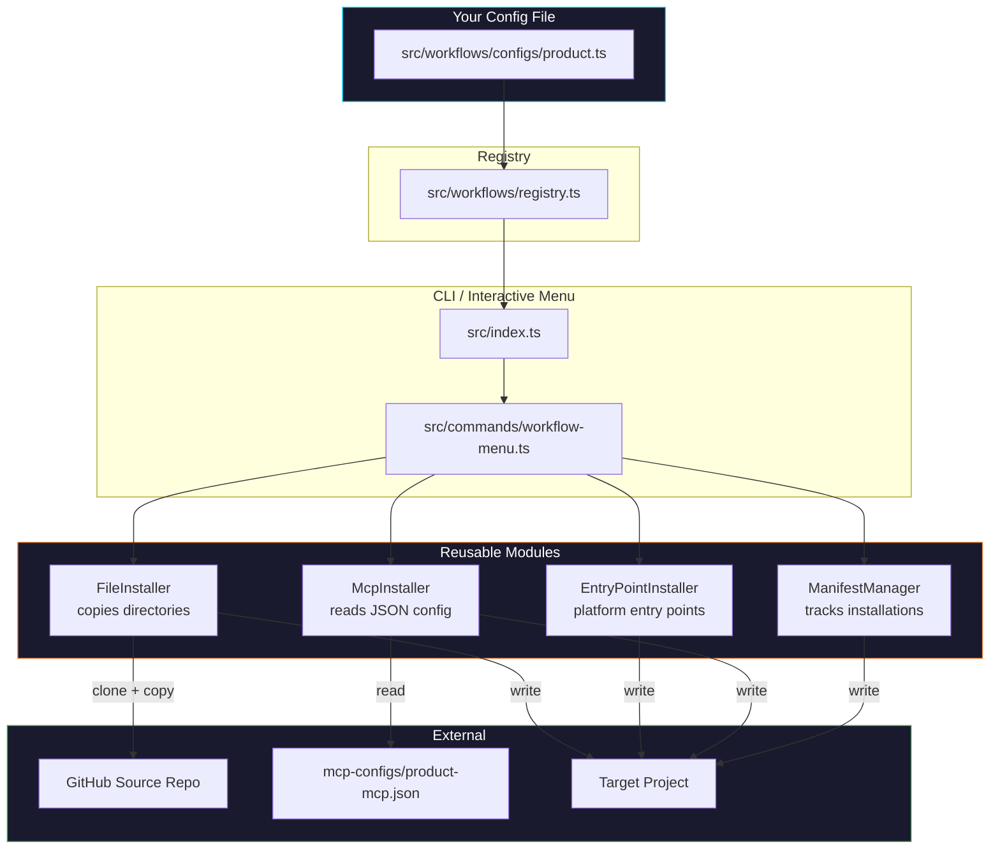

# Adding a New Workflow

This guide walks through every step needed to add a new workflow to Fluid Flow CLI. The architecture is **configuration-driven** -- you only need to create config files and register them. No new modules or command code is required.

---

## Table of Contents

- [Overview](#overview)
- [Prerequisites](#prerequisites)
- [Step-by-Step Guide](#step-by-step-guide)
  - [Step 1: Prepare the Source Repository](#step-1-prepare-the-source-repository)
  - [Step 2: Create the Workflow Config](#step-2-create-the-workflow-config)
  - [Step 3: Create the MCP Config (optional)](#step-3-create-the-mcp-config-optional)
  - [Step 4: Register the Workflow](#step-4-register-the-workflow)
  - [Step 5: Build and Test](#step-5-build-and-test)
- [Configuration Reference](#configuration-reference)
  - [WorkflowConfig](#workflowconfig)
  - [SourceConfig](#sourceconfig)
  - [InstallConfig](#installconfig)
  - [EntryPointConfig](#entrypointconfig)
  - [TechInstructionsConfig](#techinstructionsconfig)
  - [McpConfig](#mcpconfig)
  - [WorkflowFeature](#workflowfeature)
  - [MCP Server Definition](#mcp-server-definition)
- [Architecture Diagram](#architecture-diagram)
- [Complete Example: Product Workflow](#complete-example-product-workflow)
- [Checklist](#checklist)
- [FAQ](#faq)

---

## Overview


Every workflow in Fluid Flow CLI is defined by a single `WorkflowConfig` object. The system uses this config to:

1. **Show the workflow in menus** -- main menu, sub-menus, help text, and status output
2. **Clone the right source repo** -- each workflow can pull from a different GitHub repository
3. **Install the right files** -- directories, entry points, and scripts are all config-driven
4. **Configure MCP servers** -- each workflow has its own MCP server definitions in a JSON file
5. **Track installations** -- the manifest records which workflows are installed per project

**Files you will create or modify:**

| File | Action | Purpose |
|------|--------|---------|
| `src/workflows/configs/<id>.ts` | **Create** | Workflow configuration |
| `mcp-configs/<id>-mcp.json` | **Create** (optional) | MCP server definitions |
| `src/workflows/registry.ts` | **Modify** (1 line) | Register the new workflow |

---

## Prerequisites

Before adding a workflow, you need:

1. **A source repository** on GitHub containing the workflow files (e.g. `BetssonGroup/product-workflow`)
2. **An entry point file** in that repo for at least one platform (Cursor `.mdc` file or Copilot instructions)
3. **Node.js >= 20** and the ff-cli repo cloned locally

---

## Step-by-Step Guide

### Step 1: Prepare the Source Repository

Your source repository should contain the workflow files you want to install into target projects. At minimum it needs:

```
your-workflow-repo/
├── <workflow-dir>/          # Directory that gets copied (e.g. "product-workflow/")
│   ├── ...workflow files...
│   └── ...
└── .cursor/
    └── rules/
        └── <rule>.mdc       # Entry point for Cursor IDE
```

**Key decisions:**

| Decision | Example | Notes |
|----------|---------|-------|
| Workflow directory name | `product-workflow` | Gets copied into the target project root |
| Entry point file | `.cursor/rules/product.mdc` | Cursor reads `.mdc` files automatically |
| Branch | `main` | Which branch to clone from |
| Executable files | `.sh` scripts | Will be `chmod +x` on install |

### Step 2: Create the Workflow Config

Create a new file at `src/workflows/configs/<id>.ts`.

The `id` is the short identifier users will type in commands (e.g. `ff install product`). Keep it lowercase, short, and memorable.

**Template:**

```typescript
/**
 * <Name> Workflow Configuration
 *
 * <Brief description of what this workflow does.>
 * Source: <owner>/<repo>
 */

import type { WorkflowConfig } from "../types.js";

export const <id>Workflow: WorkflowConfig = {
  // ── Identity ──────────────────────────────────────────
  id: "<id>",                           // CLI identifier: ff install <id>
  name: "<Name> Workflow",              // Shown in menus
  description: "<One-line description>", // Shown next to menu item

  // ── Source Repository ─────────────────────────────────
  source: {
    owner: "BetssonGroup",              // GitHub org or user
    repo: "<repo-name>",               // Repository name
    branch: "main",                     // Branch to clone
  },

  // ── Installation ──────────────────────────────────────
  install: {
    // Directories from the source repo to copy into the target project
    directories: ["<workflow-dir>"],

    // Platform-specific entry points
    entryPoints: {
      cursor: {
        source: ".cursor/rules/<rule>.mdc",          // Path in source repo
        target: ".cursor/rules/<rule>.mdc",          // Path in target project
      },
      copilot: {
        source: ".cursor/rules/<rule>.mdc",          // Same source, different target
        target: ".github/<name>-instructions.md",    // Copilot reads from .github/
        transform: "copilot",                         // Transform Cursor format to Copilot
      },
    },

    // (Optional) Copilot technology-specific instruction files
    // techInstructions: {
    //   sourceDir: "<workflow-dir>/Instructions/technology",
    //   targetDir: ".github/instructions",
    // },

    // File extensions that should be made executable
    executableExtensions: [".sh"],
  },

  // ── MCP Servers (optional) ────────────────────────────
  mcp: {
    configFile: "mcp-configs/<id>-mcp.json",
  },

  // ── Features ──────────────────────────────────────────
  // Controls which actions appear in the workflow's sub-menu
  features: ["install", "update", "verify", "mcp"],
};
```

> **Tip:** Use the existing `src/workflows/configs/dev.ts` as a real-world reference.

### Step 3: Create the MCP Config (optional)

If your workflow includes MCP server setup (`features` includes `"mcp"`), create a JSON file at `mcp-configs/<id>-mcp.json`.

This file defines which MCP servers to configure when users run `ff mcp <id>`.

**Template:**

```json
{
  "server-name": {
    "command": "npx",
    "args": ["-y", "@scope/package-name"],
    "disabled": false,
    "autoApprove": ["tool_name_1", "tool_name_2"],
    "env": {
      "LOG_LEVEL": "INFO",
      "NODE_ENV": "production"
    }
  }
}
```

**Placeholder tokens** (resolved automatically at setup time):

| Token | Cursor resolves to | VS Code / Copilot resolves to |
|-------|--------------------|-------------------------------|
| `__GITHUB_PAT__` | `${env:GITHUB_PERSONAL_ACCESS_TOKEN}` | `${input:github-pat}` |
| `__WORKSPACE__` | `${workspaceFolder}` | `${workspaceFolder}` |

**Example** -- a workflow that needs only GitHub and a custom API server:

```json
{
  "github": {
    "command": "npx",
    "args": ["-y", "@modelcontextprotocol/server-github"],
    "disabled": false,
    "autoApprove": ["search_repositories", "get_file_contents"],
    "env": {
      "GITHUB_PERSONAL_ACCESS_TOKEN": "__GITHUB_PAT__",
      "LOG_LEVEL": "INFO"
    }
  },
  "product-api": {
    "command": "npx",
    "args": ["-y", "@company/product-mcp-server"],
    "disabled": false,
    "autoApprove": [],
    "env": {
      "API_BASE_URL": "https://api.internal.example.com"
    }
  }
}
```

> **No MCP?** If your workflow does not need MCP servers, omit the `mcp` property from the config and remove `"mcp"` from the `features` array.

### Step 4: Register the Workflow

Open `src/workflows/registry.ts` and add two lines:

1. **Import** the config at the top
2. **Add** it to the `ALL_WORKFLOWS` array

```typescript
import { devWorkflow } from "./configs/dev.js";
import { productWorkflow } from "./configs/product.js";  // <-- add import
import type { WorkflowConfig } from "./types.js";

const ALL_WORKFLOWS: WorkflowConfig[] = [
  devWorkflow,
  productWorkflow,  // <-- add to array
];
```

That's it. The rest of the system picks it up automatically.

### Step 5: Build and Test

```bash
# Build
npm run build

# Verify it appears in the CLI
ff workflows
ff --help

# Test the sub-menu
ff <id>

# Test CLI commands
ff install <id> --help
ff mcp <id> --help

# Full install test (in a test directory)
mkdir /tmp/test-workflow && cd /tmp/test-workflow
ff install <id>
```

---

## Configuration Reference

### WorkflowConfig

The top-level configuration object. Every field is documented below.

| Property | Type | Required | Description |
|----------|------|----------|-------------|
| `id` | `string` | Yes | Unique identifier, used in CLI commands (`ff install <id>`) |
| `name` | `string` | Yes | Human-readable name shown in menus |
| `description` | `string` | Yes | One-line description shown next to menu items |
| `source` | `SourceConfig` | Yes | GitHub repository to pull workflow files from |
| `install` | `InstallConfig` | Yes | What files to install and where |
| `mcp` | `McpConfig` | No | MCP server configuration file path |
| `features` | `WorkflowFeature[]` | Yes | Which actions the workflow supports |

### SourceConfig

| Property | Type | Required | Description |
|----------|------|----------|-------------|
| `owner` | `string` | Yes | GitHub org or username (e.g. `"BetssonGroup"`) |
| `repo` | `string` | Yes | Repository name (e.g. `"fluid-flow-ai"`) |
| `branch` | `string` | Yes | Branch to clone (e.g. `"main"`) |

### InstallConfig

| Property | Type | Required | Description |
|----------|------|----------|-------------|
| `directories` | `string[]` | Yes | Directories from source to copy into target root |
| `entryPoints` | `{ cursor?, copilot? }` | Yes | Platform-specific entry point files |
| `techInstructions` | `TechInstructionsConfig` | No | Copilot path-specific instruction files |
| `executableExtensions` | `string[]` | No | Extensions to `chmod +x` (default: `[".sh"]`) |

### EntryPointConfig

| Property | Type | Required | Description |
|----------|------|----------|-------------|
| `source` | `string` | Yes | Path in the source repo (relative to repo root) |
| `target` | `string` | Yes | Path in the target project (relative to project root) |
| `transform` | `"copilot"` | No | If set, transforms Cursor format to Copilot format |

**How transforms work:**

- **No transform (Cursor):** File is copied as-is from source to target
- **`"copilot"` transform:** Cursor-specific YAML frontmatter is stripped, content is reformatted for GitHub Copilot's `.github/copilot-instructions.md` format

### TechInstructionsConfig

Only relevant for Copilot installations. Creates `.github/instructions/*.instructions.md` files that provide path-specific instructions to Copilot.

| Property | Type | Required | Description |
|----------|------|----------|-------------|
| `sourceDir` | `string` | Yes | Source directory with technology instruction files |
| `targetDir` | `string` | Yes | Target directory (usually `".github/instructions"`) |

### McpConfig

| Property | Type | Required | Description |
|----------|------|----------|-------------|
| `configFile` | `string` | Yes | Path to the MCP JSON file, relative to ff-cli package root |

### WorkflowFeature

Controls which actions appear in the workflow's interactive sub-menu.

| Value | Menu Item | CLI Command |
|-------|-----------|-------------|
| `"install"` | Install | `ff install <id>` |
| `"update"` | Update | `ff update <id>` |
| `"verify"` | Verify | `ff verify` |
| `"mcp"` | MCP Setup | `ff mcp <id>` |

**Example:** A workflow without MCP and without verify:

```typescript
features: ["install", "update"],
```

### MCP Server Definition

Each entry in the MCP JSON config file follows this structure:

| Property | Type | Required | Description |
|----------|------|----------|-------------|
| `command` | `string` | Yes | Shell command to start the server (`"npx"`, `"uvx"`, etc.) |
| `args` | `string[]` | Yes | Arguments passed to the command |
| `disabled` | `boolean` | No | If `true`, server is disabled by default (Cursor only) |
| `autoApprove` | `string[]` | No | Tool names to auto-approve (Cursor only) |
| `env` | `Record<string, string>` | No | Environment variables for the server process |

---

## Architecture Diagram

This diagram shows how a workflow config flows through the modular system:



**Key insight:** The modules are completely generic. They receive a `WorkflowConfig` and act on it. You never need to modify modules, commands, or UI code to add a new workflow.

---

## Complete Example: Product Workflow

Here is a complete, copy-paste-ready example of adding a hypothetical "Product Workflow" that pulls from `BetssonGroup/product-workflow`.

### File 1: `src/workflows/configs/product.ts`

```typescript
/**
 * Product Workflow Configuration
 *
 * Product management and planning orchestration for product teams.
 * Source: BetssonGroup/product-workflow
 */

import type { WorkflowConfig } from "../types.js";

export const productWorkflow: WorkflowConfig = {
  id: "product",
  name: "Product Workflow",
  description: "Product management and planning orchestration",

  source: {
    owner: "BetssonGroup",
    repo: "product-workflow",
    branch: "main",
  },

  install: {
    directories: ["product-workflow"],

    entryPoints: {
      cursor: {
        source: ".cursor/rules/product.mdc",
        target: ".cursor/rules/product.mdc",
      },
      copilot: {
        source: ".cursor/rules/product.mdc",
        target: ".github/product-instructions.md",
        transform: "copilot",
      },
    },

    executableExtensions: [".sh"],
  },

  mcp: {
    configFile: "mcp-configs/product-mcp.json",
  },

  features: ["install", "update", "verify", "mcp"],
};
```

### File 2: `mcp-configs/product-mcp.json`

```json
{
  "atlassian": {
    "command": "npx",
    "args": ["-y", "mcp-remote", "https://mcp.atlassian.com/v1/sse"],
    "disabled": false,
    "autoApprove": ["search_jira", "get_confluence_page"],
    "env": {
      "LOG_LEVEL": "INFO",
      "NODE_ENV": "production"
    }
  },
  "github": {
    "command": "npx",
    "args": ["-y", "@modelcontextprotocol/server-github"],
    "disabled": false,
    "autoApprove": ["search_repositories", "get_file_contents"],
    "env": {
      "GITHUB_PERSONAL_ACCESS_TOKEN": "__GITHUB_PAT__",
      "LOG_LEVEL": "INFO"
    }
  }
}
```

### File 3: `src/workflows/registry.ts` (modified)

```typescript
import { devWorkflow } from "./configs/dev.js";
import { productWorkflow } from "./configs/product.js";   // <-- new
import type { WorkflowConfig } from "./types.js";

const ALL_WORKFLOWS: WorkflowConfig[] = [
  devWorkflow,
  productWorkflow,   // <-- new
];

// ... rest of file unchanged ...
```

### Result

After `npm run build`, the Product Workflow is fully functional:

```bash
ff workflows                          # Lists: dev, product
ff product                            # Opens product sub-menu
ff install product                    # Installs for both Cursor + Copilot
ff mcp product                        # Configures MCP servers (both IDEs)
ff update product                     # Updates to latest
```

---

## Checklist

Use this checklist when adding a new workflow:

- [ ] Source repository exists on GitHub and is accessible
- [ ] Source repo has at least one entry point file (`.cursor/rules/<name>.mdc`)
- [ ] Source repo has the directory/directories listed in `install.directories`
- [ ] Created `src/workflows/configs/<id>.ts` with a valid `WorkflowConfig`
- [ ] Created `mcp-configs/<id>-mcp.json` (if workflow has MCP feature)
- [ ] Added import + array entry in `src/workflows/registry.ts`
- [ ] `npm run build` succeeds with no errors
- [ ] `ff workflows` shows the new workflow
- [ ] `ff <id>` opens the sub-menu with correct actions
- [ ] `ff install <id> --help` shows correct help text
- [ ] Tested full install in a temporary directory
- [ ] Tested MCP setup (if applicable)
- [ ] Committed and pushed changes

---

## FAQ

### Can I add a workflow without MCP support?

Yes. Omit the `mcp` property from your config and remove `"mcp"` from the `features` array:

```typescript
export const minimalWorkflow: WorkflowConfig = {
  id: "minimal",
  name: "Minimal Workflow",
  description: "A workflow without MCP",
  source: { owner: "BetssonGroup", repo: "minimal-workflow", branch: "main" },
  install: {
    directories: ["workflow-files"],
    entryPoints: {
      cursor: {
        source: ".cursor/rules/minimal.mdc",
        target: ".cursor/rules/minimal.mdc",
      },
    },
  },
  features: ["install", "update"],  // no "mcp", no "verify"
};
```

### Can I support only Cursor or only Copilot?

Yes. Only define the entry points you need:

```typescript
// Cursor only
entryPoints: {
  cursor: { source: "...", target: "..." },
},

// Copilot only
entryPoints: {
  copilot: { source: "...", target: "...", transform: "copilot" },
},
```

The install flow will prompt the user to choose a platform, and if the selected platform has no entry point configured, a warning is shown.

### Can two workflows install into the same project?

Yes. The manifest (`.fluid-flow.json`) tracks each workflow independently:

```json
{
  "version": 2,
  "workflows": {
    "dev": { "platform": "cursor", "commitSha": "abc...", ... },
    "product": { "platform": "cursor", "commitSha": "def...", ... }
  }
}
```

Each workflow can have different platforms, different source repos, and different installed paths.

### Can two workflows share the same source repository?

Yes. Just point both configs to the same `source.owner` / `source.repo` but use different `install.directories`.

### What if my workflow needs a custom module or behavior?

The current architecture handles most cases through configuration. If you truly need custom logic (e.g. a post-install hook, a custom transform, or a new entry point format), you would need to extend the modules. Open an issue or discuss with the team before adding custom code.

### Where do I find the existing dev workflow config as a reference?

The dev workflow config is the canonical reference:

- **Config:** `src/workflows/configs/dev.ts`
- **MCP JSON:** `mcp-configs/dev-mcp.json`
- **Types:** `src/workflows/types.ts`
