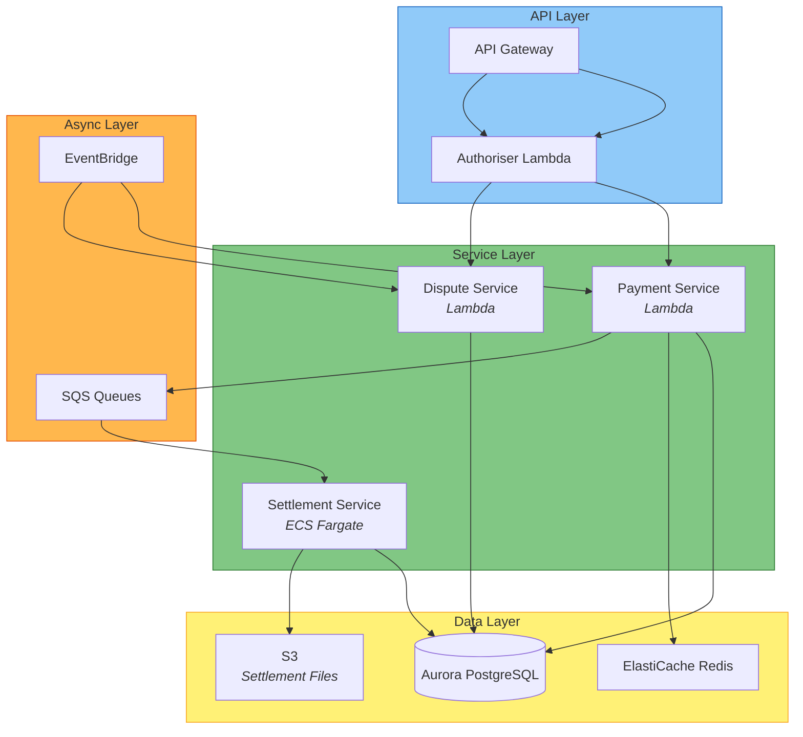
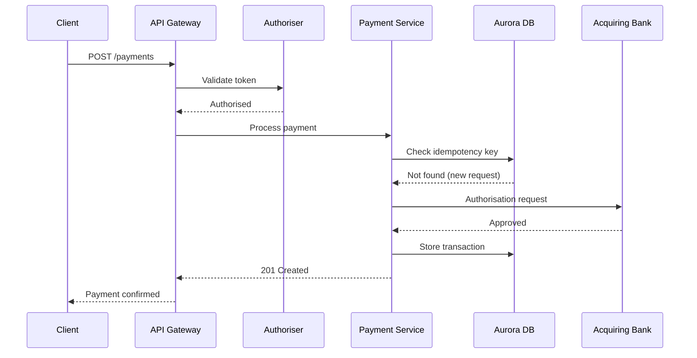

# Architecture

## System Overview

The platform follows a microservices architecture deployed on AWS. Services
communicate via API Gateway (synchronous) and SQS/EventBridge (asynchronous).

## Architecture Diagram

## Data Flow

## Component Descriptions

| Component | Type | Purpose | Dependencies |
|-----------|------|---------|-------------|
| payment-api | Lambda | Processes payment requests | Aurora, Redis, SQS |
| settlement-engine | ECS Fargate | Nightly batch settlement | Aurora, S3 |
| dispute-service | Lambda | Handles chargebacks | Aurora, EventBridge |
| authoriser | Lambda | JWT token validation | Cognito |

## Integration Points

| External System | Protocol | Purpose |
|----------------|----------|---------|
| Acquiring Bank API | REST (HTTPS) | Card authorisation and settlement |
| Fraud Detection | gRPC | Real-time fraud scoring |
| SendGrid | REST | Transaction notification emails |
