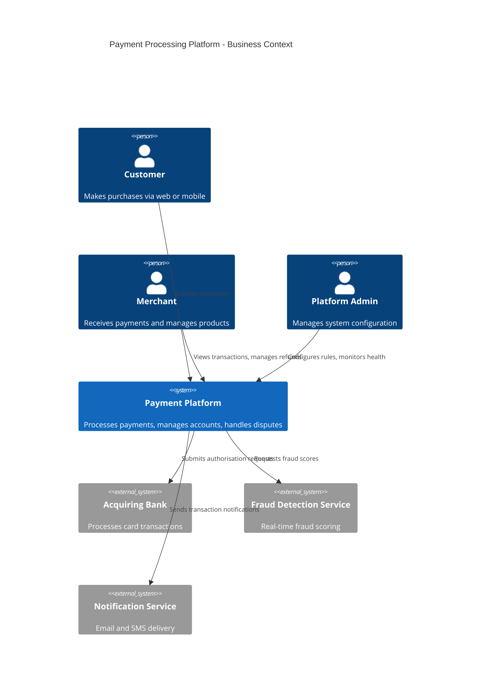

# Business Overview

## Business Context Diagram

## Business Description

The Payment Processing Platform handles end-to-end payment lifecycle management
for e-commerce merchants. Core business transactions include:

- **Payment Authorisation**: Customer initiates payment, platform validates,
  sends to acquiring bank, returns result
- **Settlement**: Batch processing of authorised transactions for merchant payout
- **Dispute Management**: Chargeback handling, evidence collection, resolution tracking

## Business Dictionary

| Term | Definition |
|------|-----------|
| Authorisation | Verification that funds are available and the transaction is legitimate |
| Settlement | Transfer of funds from acquiring bank to merchant account |
| Chargeback | Customer-initiated dispute reversing a completed transaction |
| PCI DSS | Payment Card Industry Data Security Standard |

## Component Business Descriptions

### payment-api
Handles inbound payment requests from merchant integrations. Validates request
format, applies business rules, and routes to the processing pipeline.

### settlement-engine
Runs nightly batch jobs to aggregate authorised transactions and submit
settlement files to the acquiring bank.
