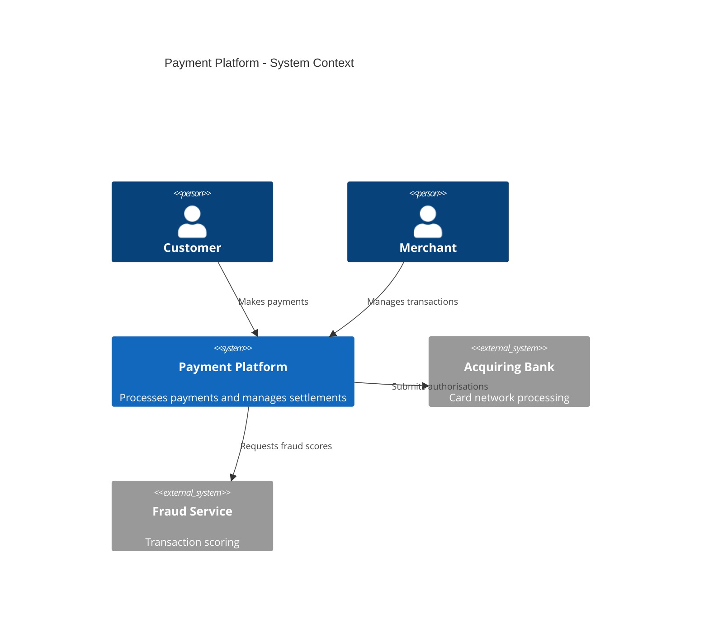
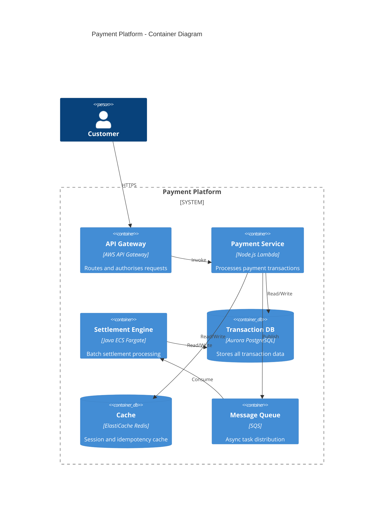
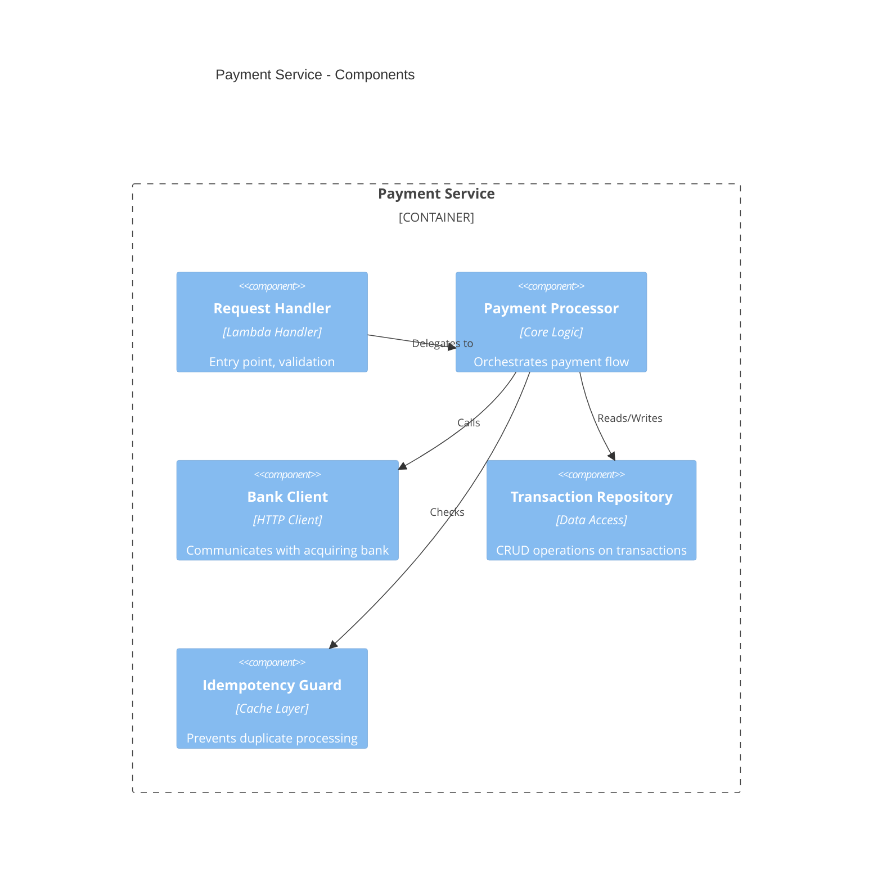
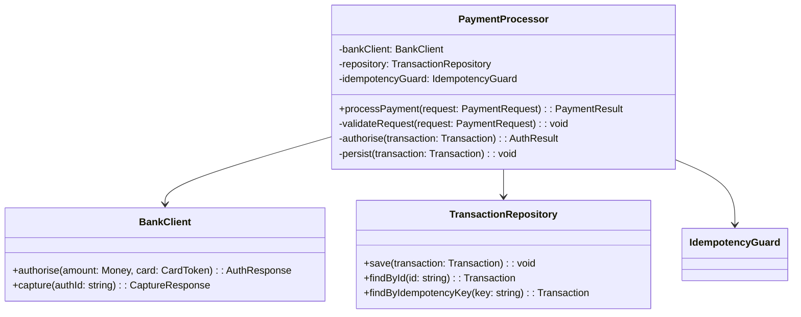

# C4 Architecture

## Level 1: System Context

```mermaid
C4Context
    title Payment Platform - System Context

    Person(customer, "Customer")
    Person(merchant, "Merchant")

    System(platform, "Payment Platform", "Processes payments and manages settlements")

    System_Ext(bank, "Acquiring Bank", "Card network processing")
    System_Ext(fraud, "Fraud Service", "Transaction scoring")

    Rel(customer, platform, "Makes payments")
    Rel(merchant, platform, "Manages transactions")
    Rel(platform, bank, "Submits authorisations")
    Rel(platform, fraud, "Requests fraud scores")
```

## Level 2: Container

```mermaid
C4Container
    title Payment Platform - Container Diagram

    Person(customer, "Customer")

    System_Boundary(platform, "Payment Platform") {
        Container(api, "API Gateway", "AWS API Gateway", "Routes and authorises requests")
        Container(pay, "Payment Service", "Node.js Lambda", "Processes payment transactions")
        Container(settle, "Settlement Engine", "Java ECS Fargate", "Batch settlement processing")
        ContainerDb(db, "Transaction DB", "Aurora PostgreSQL", "Stores all transaction data")
        ContainerDb(cache, "Cache", "ElastiCache Redis", "Session and idempotency cache")
        Container(queue, "Message Queue", "SQS", "Async task distribution")
    }

    Rel(customer, api, "HTTPS")
    Rel(api, pay, "Invoke")
    Rel(pay, db, "Read/Write")
    Rel(pay, cache, "Read/Write")
    Rel(pay, queue, "Publish")
    Rel(queue, settle, "Consume")
    Rel(settle, db, "Read/Write")
```

## Level 3: Component (Payment Service)

```mermaid
C4Component
    title Payment Service - Components

    Container_Boundary(pay, "Payment Service") {
        Component(handler, "Request Handler", "Lambda Handler", "Entry point, validation")
        Component(processor, "Payment Processor", "Core Logic", "Orchestrates payment flow")
        Component(bankClient, "Bank Client", "HTTP Client", "Communicates with acquiring bank")
        Component(repo, "Transaction Repository", "Data Access", "CRUD operations on transactions")
        Component(idempotency, "Idempotency Guard", "Cache Layer", "Prevents duplicate processing")
    }

    Rel(handler, processor, "Delegates to")
    Rel(processor, bankClient, "Calls")
    Rel(processor, repo, "Reads/Writes")
    Rel(processor, idempotency, "Checks")
```

## Level 4: Code (Payment Processor)

```mermaid
classDiagram
    class PaymentProcessor {
        -bankClient: BankClient
        -repository: TransactionRepository
        -idempotencyGuard: IdempotencyGuard
        +processPayment(request: PaymentRequest): PaymentResult
        -validateRequest(request: PaymentRequest): void
        -authorise(transaction: Transaction): AuthResult
        -persist(transaction: Transaction): void
    }

    class BankClient {
        +authorise(amount: Money, card: CardToken): AuthResponse
        +capture(authId: string): CaptureResponse
    }

    class TransactionRepository {
        +save(transaction: Transaction): void
        +findById(id: string): Transaction
        +findByIdempotencyKey(key: string): Transaction
    }

    PaymentProcessor --> BankClient
    PaymentProcessor --> TransactionRepository
    PaymentProcessor --> IdempotencyGuard
```
