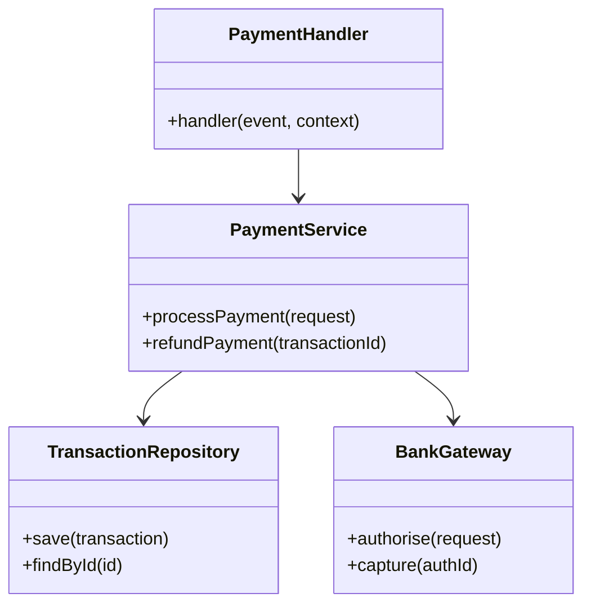

# Code Structure

## Build System

| Property | Value |
|----------|-------|
| Type | npm (monorepo with workspaces) |
| Config | `package.json`, `tsconfig.json` |
| Build | `npm run build` (TypeScript compilation) |
| Test | `npm test` (Jest) |
| Lint | `npm run lint` (ESLint + Prettier) |

## Key Classes/Modules

## Existing Files Inventory

| File | Purpose |
|------|---------|
| `src/handlers/payment-handler.ts` | Lambda entry point for payment requests |
| `src/services/payment-service.ts` | Core payment processing logic |
| `src/repositories/transaction-repo.ts` | Aurora database operations |
| `src/clients/bank-gateway.ts` | HTTP client for acquiring bank API |
| `src/models/transaction.ts` | Transaction entity definition |
| `src/middleware/auth.ts` | JWT validation middleware |
| `infra/lib/payment-stack.ts` | CDK stack for payment service |

## Design Patterns

| Pattern | Location | Purpose |
|---------|----------|---------|
| Repository | `src/repositories/` | Abstracts data access behind interfaces |
| Gateway | `src/clients/` | Encapsulates external service communication |
| Middleware Chain | `src/middleware/` | Request validation and auth pipeline |
| Factory | `src/models/` | Transaction creation with validation |

## Critical Dependencies

| Dependency | Version | Purpose |
|-----------|---------|---------|
| aws-sdk | 3.x | AWS service clients |
| pg | 8.x | PostgreSQL driver |
| jsonwebtoken | 9.x | JWT token handling |
| zod | 3.x | Request validation |
