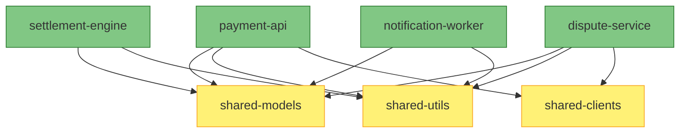

# Dependencies

## Internal Dependencies

| Source | Target | Type | Reason |
|--------|--------|------|--------|
| payment-api | shared-models | Compile | Transaction and card type definitions |
| payment-api | shared-utils | Compile | Logging and error handling |
| payment-api | shared-clients | Compile | Bank API client |
| settlement-engine | shared-models | Compile | Transaction models for batch processing |
| settlement-engine | shared-utils | Compile | Date formatting and logging |

## External Dependencies

| Dependency | Version | Purpose | Licence |
|-----------|---------|---------|---------|
| @aws-sdk/client-dynamodb | 3.x | DynamoDB operations | Apache 2.0 |
| pg | 8.x | PostgreSQL database driver | MIT |
| zod | 3.x | Request schema validation | MIT |
| jsonwebtoken | 9.x | JWT token verification | MIT |
| pino | 8.x | Structured JSON logging | MIT |
