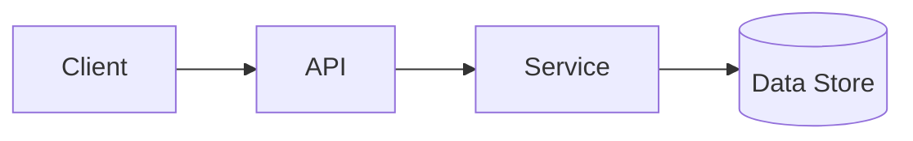
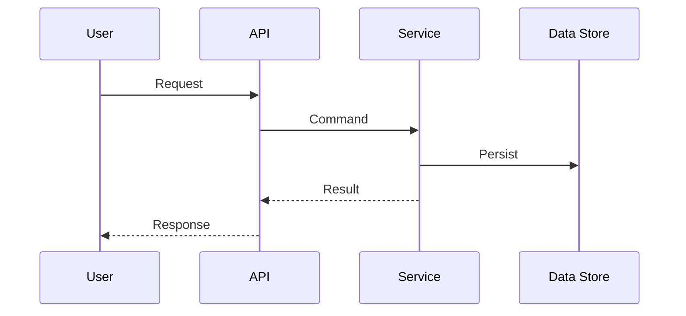

# Onboarding Presentations (sli-dev)

**Purpose**: Create onboarding materials derived from reverse engineering artifacts so new joiners can understand the system quickly.

**Outputs**:
- Engineer onboarding source: `specs/{BRANCH_NAME}/inception/onboarding/engineers/onboarding-engineers.md`
- Product onboarding source: `specs/{BRANCH_NAME}/inception/onboarding/product/onboarding-product.md`

**Optional build outputs** (if sli-dev build is configured in the repo):
- `specs/{BRANCH_NAME}/inception/onboarding/slides/engineers/` (HTML/PDF as configured)
- `specs/{BRANCH_NAME}/inception/onboarding/slides/product/` (HTML/PDF as configured)

## Step 1: Load Inputs (Mandatory)
- Reverse engineering artifacts under `specs/_project/reverse-engineering/` including:
  - Business overview
  - Architecture documentation
  - Code structure
  - API documentation
  - Component inventory
  - Interaction diagrams (Mermaid)
  - Technology stack
  - Dependencies
- ADRs and technical principles from `./adrs-technical-principles.md` (for consistency, not for decisions)
- Any existing onboarding docs (if present) to preserve intent and reduce churn

## Step 2: Create/Update Feature Registry (Mandatory)
Ensure a feature registry exists:
- File: `specs/{BRANCH_NAME}/features/features-registry.md`

If missing, create it with this structure:

```markdown
# Features Registry

> Purpose: A lightweight index of features and their impact, used to keep onboarding materials current.

## Feature: <feature-name>
- **Status**: Proposed | In Progress | Shipped | Deprecated
- **Owner Persona(s)**: Engineer | Product Manager | Operations | Support
- **Business Purpose**: <1-3 sentences>
- **Primary User Journey**: <short description>
- **Impacted Components/Services**:
  - <service/component>
- **Interfaces Impacted**:
  - APIs: <endpoints or OpenAPI/Smithy refs>
  - Events: <topics/events>
  - Data: <tables/streams>
- **Operational Impact**:
  - Observability: <metrics/logs/traces>
  - On-call: <alerts/runbooks>
  - Risks: <top risks>
- **Onboarding Touchpoints**:
  - Engineer deck sections: <list of headings>
  - Product deck sections: <list of headings>
- **Evidence Links**:
  - Reverse engineering: <relative links to artifacts>
  - Requirements/Units: <relative links when available>

---
```

## Step 3: Define Slide Sources and Conventions (Mandatory)
- Use sli-dev compatible Markdown (no unsupported syntax).
- Include a short "Source Anchors" note on any slide that introduces factual system details.
  - Source anchors must point to internal artifacts (relative paths), not external links.
- Use Mermaid diagrams where useful, but keep them minimal and readable.
- Provide text alternatives under diagrams as required by `../../shared/memory/content-validation.md`.

## Step 4: Generate Engineer Onboarding Deck
Create or update: `specs/{BRANCH_NAME}/inception/onboarding/engineers/onboarding-engineers.md`

### Required outline
1. Title and scope (what this deck covers, what it does not)
2. System at a glance (business context, top capabilities)
3. Architecture overview (packages, services, data stores)
4. Domain and ownership map (teams/domains if known)
5. Key technical flows (2-4 Mermaid sequence diagrams)
6. Service inventory (what exists and why)
7. Local development workflow (how to run, test, debug)
8. CI/CD and environments (high level, where to look)
9. Observability and operations (logging, metrics, tracing, runbooks)
10. Common pitfalls and troubleshooting
11. Glossary (shared terms)

### Engineer deck template
Use this as a starting skeleton:

```markdown
# Engineer Onboarding

## 1. Scope
- What you will learn
- What is out of scope

## 2. System at a glance
- Capabilities summary
- Business context

## 3. Architecture overview

Text alternative: <describe diagram in 1-3 sentences>

Source anchors:
- `specs/_project/reverse-engineering/architecture.md`

## 4. Domain and ownership map
- <domains/services ownership summary>

## 5. Key flows
### Flow: <name>

Text alternative: <describe the flow>

Source anchors:
- <relative links to reverse engineering artifacts>

## 6. Service inventory
- <table or bullets listing services/components, responsibilities, dependencies>

## 7. Local development workflow
- Setup
- Run
- Test
- Debug

## 8. CI/CD and environments
- Pipelines overview
- Environment types
- Where to find config

## 9. Observability and operations
- Logs
- Metrics
- Traces
- Runbooks and alerts

## 10. Common pitfalls
- <top pitfalls>

## 11. Glossary
- <term>: <definition>
```

## Step 5: Generate Product Manager Onboarding Deck
Create or update: `specs/{BRANCH_NAME}/inception/onboarding/product/onboarding-product.md`

### Required outline
1. Title and scope (what this deck covers, what it does not)
2. Capabilities overview (what the system enables)
3. Customer journeys (2-5 key journeys, high level)
4. Product concepts and terminology (glossary)
5. Dependencies and constraints (at a high level, avoid deep technical detail)
6. Release and change lifecycle (how work ships, who to involve)
7. Metrics and monitoring (where to find product signals)
8. Operational workflows (support, incident, escalation touchpoints)
9. FAQ (common questions PMs ask)

### Product deck template

```markdown
# Product Manager Onboarding

## 1. Scope
- What you will learn
- What is out of scope

## 2. Capabilities overview
- Capability: <name> - <description>
Source anchors:
- `specs/_project/reverse-engineering/business-overview.md`

## 3. Customer journeys
### Journey: <name>
- Entry points
- Key steps
- Success criteria
- Where the data lives (high level)

Source anchors:
- <relative links to reverse engineering artifacts>

## 4. Concepts and terminology
- <term>: <definition>

## 5. Dependencies and constraints
- External dependencies
- Internal dependencies
- Constraints (high level)

## 6. Release and change lifecycle
- How features are delivered
- Who signs off
- Typical lead times (avoid exact numbers unless known)

## 7. Metrics and monitoring
- Primary KPIs (where to find them)
- Operational signals (where to find them)

## 8. Operational workflows
- Support requests
- Incident process (high level)
- Escalation path

## 9. FAQ
- <question>: <answer>
```

## Step 6: Content Validation (Mandatory)
Before writing any files:
- Validate Mermaid syntax
- Provide text alternatives for diagrams
- Ensure sli-dev Markdown is compatible
- Ensure "Source anchors" exist and are relative paths

## Step 7: Present Completion Message (Mandatory)
Present a completion message in this structure:

```markdown
# 📚 Onboarding Presentations Complete

## Generated/Updated
- Engineer onboarding: `specs/{BRANCH_NAME}/inception/onboarding/engineers/onboarding-engineers.md`
- Product onboarding: `specs/{BRANCH_NAME}/inception/onboarding/product/onboarding-product.md`
- Feature registry: `specs/{BRANCH_NAME}/features/features-registry.md` (created or updated)

## Notes
- Any major assumptions
- Any missing inputs that reduced accuracy
- Suggested next improvements (optional, short)

> **📋 REVIEW REQUIRED**
> Please review both onboarding sources and confirm whether they are acceptable.
```

## Step 8: Wait for Explicit Approval
Do not proceed until the user explicitly approves or requests changes.
Log the user's response in `audit.md` with timestamp and raw input.
