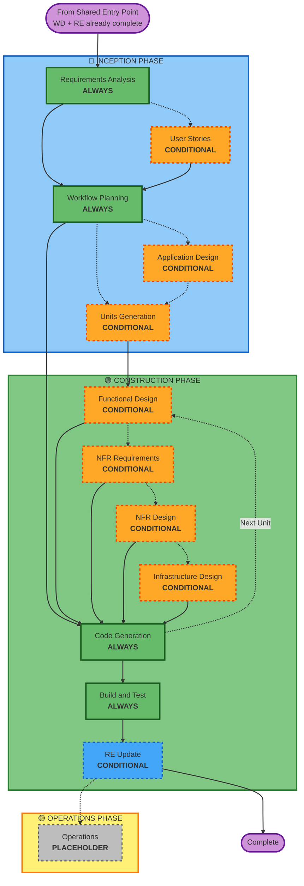

# AWS AI-DLC Adaptive Workflow Overview

**Purpose**: Technical reference for AI model and developers to understand the AWS AI-DLC workflow structure.

**Note**: This workflow is invoked from the shared entry point (fluid-flow-rules.md) after complexity assessment determines the request requires the full AWS AI-DLC treatment. Workspace Detection and Reverse Engineering are handled by the shared entry point before this workflow begins.

## The Three-Phase Lifecycle:
- **INCEPTION PHASE**: Planning and architecture (Requirements Analysis + conditional phases + Workflow Planning)
- **CONSTRUCTION PHASE**: Design, implementation, build and test (per-unit design + Code Planning/Generation + Build & Test + RE Update)
- **OPERATIONS PHASE**: Placeholder for future deployment and monitoring workflows

## The Adaptive Workflow:
**Requirements Analysis** (always, adaptive depth) → **Conditional Phases** (as needed) → **Workflow Planning** (always) → **Code Generation** (always, per-unit) → **Build and Test** (always) → **RE Update** (if brownfield)

**Note**: Workspace Detection and Reverse Engineering are handled by the shared entry point (fluid-flow-rules.md) before this workflow starts. Their artifacts are available at `specs/{BRANCH_NAME}/workspace-detection.md` and `specs/_project/reverse-engineering/`.

## How It Works:
- **AI analyzes** your request, workspace, and complexity to determine which stages are needed
- **These stages always execute**: Requirements Analysis (adaptive depth), Workflow Planning, Code Generation (per-unit), Build and Test
- **All other stages are conditional**: User Stories, Application Design, Units Generation, per-unit design stages (Functional Design, NFR Requirements, NFR Design, Infrastructure Design)
- **No fixed sequences**: Stages execute in the order that makes sense for your specific task

## Your Team's Role:
• **Answer questions** in dedicated question files using [Answer]: tags with letter choices (A, B, C, D, E)
• **Option E available**: Choose "Other" and describe your custom response if provided options don't match
• **AI Best Judgement option**: For every question iteration, you can choose to let the AI answer using its best judgement. The AI fills all answers with reasoning, flags low-confidence items, and you review and override any you disagree with before proceeding.
• **Work as a team** to review and approve each phase before proceeding
• **Collectively decide** on architectural approach when needed
• **Important**: This is a team effort - involve relevant stakeholders for each phase

## AI-DLC Three-Phase Workflow:

**Stage Descriptions:**

**Shared Entry Point** (fluid-flow-rules.md) - Handled Before AWS Workflow
- Branch Creation: Create numbered feature branch (ALWAYS)
- Workspace Detection: Analyze workspace state and project type (ALWAYS)
- Reverse Engineering: Analyze existing codebase (CONDITIONAL - Brownfield, run-once per project)
- Complexity Assessment: Evaluate and route to appropriate workflow (ALWAYS)

**🔵 INCEPTION PHASE** - Planning and Architecture (AWS AI-DLC starts here)
- Requirements Analysis: Gather and validate requirements (ALWAYS - Adaptive depth)
- User Stories: Create user stories and personas (CONDITIONAL)
- Workflow Planning: Create execution plan (ALWAYS)
- Application Design: High-level component identification and service layer design (CONDITIONAL)
- Units Generation: Decompose into units of work (CONDITIONAL)

**🟢 CONSTRUCTION PHASE** - Design, Implementation, Build and Test
- Functional Design: Detailed business logic design per unit (CONDITIONAL, per-unit)
- NFR Requirements: Determine NFRs and select tech stack (CONDITIONAL, per-unit)
- NFR Design: Incorporate NFR patterns and logical components (CONDITIONAL, per-unit)
- Infrastructure Design: Map to actual infrastructure services (CONDITIONAL, per-unit)
- Code Generation: Generate code with Part 1 - Planning, Part 2 - Generation (ALWAYS, per-unit)
- Build and Test: Build all units and execute comprehensive testing (ALWAYS)
- RE Update: Incrementally update reverse engineering artifacts (CONDITIONAL - if brownfield)

**🟡 OPERATIONS PHASE** - Placeholder
- Operations: Placeholder for future deployment and monitoring workflows (PLACEHOLDER)

**Key Principles:**
- Phases execute only when they add value
- Each phase independently evaluated
- INCEPTION focuses on "what" and "why"
- CONSTRUCTION focuses on "how" plus "build and test"
- OPERATIONS is placeholder for future expansion
- Simple changes may skip conditional INCEPTION stages
- Complex changes get full INCEPTION and CONSTRUCTION treatment