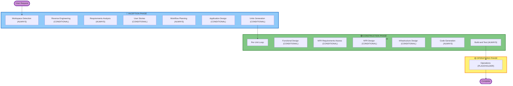

# AI-DLC Welcome Message

**Purpose**: This file contains the user-facing welcome message that should be displayed ONCE at the start of any AI-DLC workflow.

---

# 👋 Welcome to Betsson Group AI-DLC (AI-Driven Development Life Cycle)! 👋

I'll guide you through an adaptive software development workflow that intelligently tailors itself to your specific needs.

## What is the Betsson Group AI-DLC?

AI-DLC is a structured yet flexible software development process that adapts to your project's needs. Think of it as having an experienced software architect who:

- **Analyzes your requirements** and asks clarifying questions when needed
- **Plans the optimal approach** based on complexity and risk
- **Skips unnecessary steps** for simple changes while providing comprehensive coverage for complex projects
- **Documents everything** so you have a complete record of decisions and rationale
- **Guides you through each phase** with clear checkpoints and approval gates

## The Three-Phase Lifecycle

### Phase Breakdown:

**INCEPTION PHASE** - *Planning & Application Design*
- **Purpose**: Determines WHAT to build and WHY
- **Activities**: Understanding requirements, analyzing existing code (if any), planning the approach
- **Output**: Clear requirements, execution plan, decisions on the number of units of work for parallel development
- **Your Role**: Answer questions, review plans, approve direction

**CONSTRUCTION PHASE** - *Detailed Design, Implementation & Test*
- **Purpose**: Determines HOW to build it
- **Activities**: Detailed design (when needed), code generation, comprehensive testing
- **Output**: Working code, tests, build instructions
- **Your Role**: Review designs, approve implementation plans, validate results

**OPERATIONS PHASE** - *Deployment & Monitoring (Future)*
- **Purpose**: How to DEPLOY and RUN it
- **Status**: Placeholder for future deployment and monitoring workflows
- **Current State**: Build and test activities handled in CONSTRUCTION phase

## Key Principles:

- ⚡ **Fully Adaptive**: Each stage independently evaluated based on your needs
- 🎯 **Efficient**: Simple changes execute only essential stages
- 📋 **Comprehensive**: Complex changes get full treatment with all safeguards
- 🔍 **Transparent**: You see and approve the execution plan before work begins
- 📝 **Documented**: Complete audit trail of all decisions and changes
- 🎛️ **User Control**: You can request stages be included or excluded

## What Happens Next:

1. **I'll analyze your workspace** to understand if this is a new or existing project
2. **I'll gather requirements** and ask clarifying questions if needed
3. **I'll create an execution plan** showing which stages I propose to run and why
4. **You'll review and approve** the plan (or request changes)
5. **We'll execute the plan** with checkpoints at each major stage
6. **You'll get working code** with complete documentation and tests

The AI-DLC process adapts to:
- 📋 Your intent clarity and complexity
- 🔍 Existing codebase state
- 🎯 Scope and impact of changes
- ⚡ Risk and quality requirements

Let's begin!
