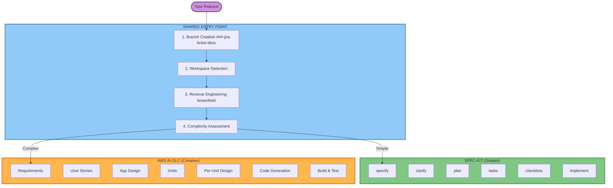

# Welcome Message

**Purpose**: This file contains the user-facing welcome message that should be displayed ONCE at the start of any Fluid Flow AI workflow.

---

# Welcome to Fluid Flow AI - Adaptive Software Development

I'll guide you through an adaptive software development workflow that intelligently tailors itself to your specific needs.

## What is Fluid Flow AI?

Fluid Flow AI is a unified development process that combines two workflow paths under a single entry point. It analyzes your request, understands your codebase, and routes you to the right workflow:

- **Spec-Kit** (for simpler, well-scoped features): A streamlined specification-to-implementation pipeline
- **AWS AI-DLC** (for complex, enterprise-grade work): A comprehensive SDLC with full governance

## How It Works

### Shared Entry Point

Every feature starts the same way:
1. **A numbered branch is created** (e.g., `001-proj-1234-add-user-auth`) with a dedicated feature directory
2. **Your workspace is scanned** to understand if this is a new or existing project
3. **For existing projects**: The codebase is analyzed once to create architectural documentation (reused across features)
4. **Complexity is assessed**: The AI evaluates scope, risk, architecture, infrastructure, and requirements clarity
5. **A workflow is recommended**: You review and approve (or override) the recommendation

### Spec-Kit Path (Simpler Features)

For well-scoped features with clear requirements:
- Create a feature specification from natural language
- Clarify ambiguities interactively
- Generate an implementation plan with data models and contracts
- Break down into ordered, dependency-aware tasks
- Execute implementation with progress tracking

### AWS AI-DLC Path (Complex Features)

For enterprise-grade work requiring full governance:
- Comprehensive requirements analysis with adaptive depth
- User stories with acceptance criteria
- Application design and units generation
- Per-unit functional design, NFR assessment, infrastructure design
- Structured code generation with build and test instructions

## Shared Governance

Both workflows share the same governance backbone:
- **AI Operating Contract**: AI proposes, humans decide
- **Security Rules**: ISO 27001 compliance, data classification, access control
- **Quality Management**: ISO 9001 principles
- **Review Gates**: AI self-review and human approval gates
- **Content Validation**: Mermaid diagrams, markdown validation
- **Full Audit Trail**: Every interaction logged with timestamps
- **State Tracking**: Progress tracked in every feature directory

## Your Role

- **Answer questions** to clarify requirements and make decisions
- **Review and approve** at each checkpoint before proceeding
- **Override recommendations** when you have better context
- **Work as a team** to review designs and plans with relevant stakeholders

## What Happens Next

1. **I'll create a feature branch** for your work
2. **I'll analyze your workspace** to understand the project context
3. **I'll assess complexity** and recommend a workflow
4. **You'll confirm** the workflow (or choose the other)
5. **We'll execute** with checkpoints at each stage

Let's begin!
