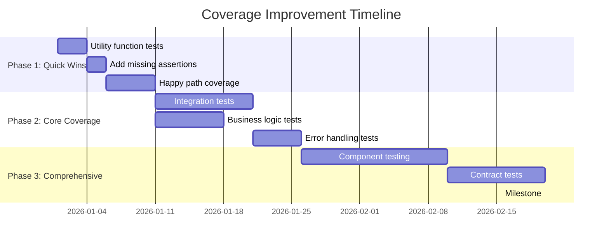
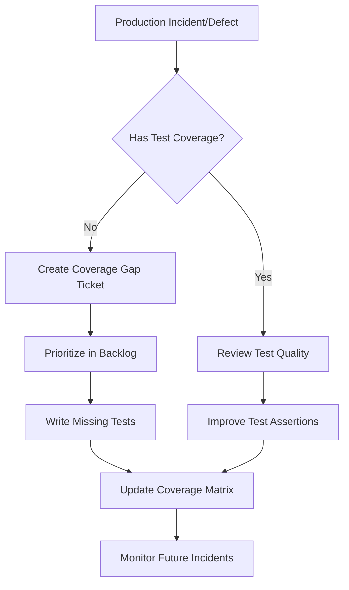

# Test Coverage Analysis & Improvement Strategy

**Purpose**: Systematically analyze a repository's test coverage across all testing layers, identify coverage gaps correlated with business risk and production incidents, and produce a risk-prioritized action plan to reach a target coverage level.

This stage operates in **two phases**:
- **Phase 1 (Baseline)**: Runs during Reverse Engineering — produces the project-level baseline at `specs/_project/reverse-engineering/test-coverage-analysis.md`
- **Phase 2 (Delta & Improvement)**: Runs after implementation (Build & Test / speckit.implement) — produces the feature-level coverage delta and improvement plan at `specs/{BRANCH_NAME}/construction/coverage-improvement-plan.md`

---

# PHASE 1: Baseline Analysis (Reverse Engineering)

**Execute during**: Reverse Engineering stage (shared and AWS variants)
**Output artifact**: `specs/_project/reverse-engineering/test-coverage-analysis.md`
**Run-once behavior**: Same as other RE artifacts — generated once, updated incrementally post-implementation.

## Prerequisites

- [ ] **Target repository** identified and accessible
- [ ] **Testing frameworks** in use identified (Jest, Pytest, JUnit, Vitest, etc.)
- [ ] **Coverage tools** configured (Istanbul/nyc, coverage.py, JaCoCo, etc.)
- [ ] **CI/CD pipeline** access for existing coverage reports (optional but recommended)
- [ ] **Production incident/defect data** available (optional but recommended)
- [ ] **Production usage analytics** accessible (optional for risk-based prioritization)

---

## Step 1: Repository Discovery & Technology Assessment

**Analyze the repository structure to understand the testing landscape:**

### 1.1 Identify Technology Stack
- Explore the repository root
- Identify primary language(s): TypeScript, JavaScript, Python, Java, Go, C#, etc.
- Locate configuration files:
  - JavaScript/TypeScript: `package.json`, `tsconfig.json`
  - Python: `requirements.txt`, `pyproject.toml`, `setup.py`
  - Java: `pom.xml`, `build.gradle`
  - .NET: `*.csproj`, `*.sln`

### 1.2 Locate Testing Frameworks & Configuration
- Search for test configuration files:
  ```
  jest.config.*, vitest.config.*, pytest.ini, conftest.py,
  karma.conf.*, cypress.config.*, playwright.config.*
  ```
- Identify coverage tools: Istanbul/nyc, coverage.py, JaCoCo, Cobertura, dotCover
- Search for patterns: `"coverage"`, `"jest"`, `"pytest"`, `"@Test"`, `"describe("`

### 1.3 Map Test Directory Structure
- Common patterns:
  - `__tests__/`, `test/`, `tests/`, `spec/`
  - `*.test.ts`, `*.spec.ts`, `test_*.py`, `*_test.py`, `*Test.java`

**Output:** Document the testing stack, frameworks, coverage tools, and directory conventions.

---

## Step 2: Current Coverage Assessment

**Gather comprehensive coverage metrics:**

### 2.1 Check Existing Coverage Reports
- Look for report directories:
  - JavaScript: `coverage/`, `.nyc_output/`
  - Python: `htmlcov/`, `.coverage`
  - Java: `target/site/jacoco/`
  - .NET: `TestResults/`, `coverlet/`
- Search CI configuration for coverage settings in:
  `.github/workflows/*.yml`, `Jenkinsfile`, `.gitlab-ci.yml`, `azure-pipelines.yml`

### 2.2 Analyze Coverage Configuration
- Extract coverage thresholds from configuration files
- Identify excluded paths and patterns (node_modules, vendor, generated code)
- Note any coverage enforcement in quality gates
- Check for mutation testing configuration (Stryker, mutmut, PIT)

### 2.3 Run Coverage Analysis
Execute coverage commands appropriate to the stack:

```bash
# JavaScript/TypeScript (Jest)
npm run test -- --coverage --coverageReporters=json-summary

# Python
pytest --cov=src --cov-report=json

# Java (Maven)
mvn test jacoco:report

# .NET
dotnet test --collect:"XPlat Code Coverage"
```

### 2.4 Document Current State

**Coverage Metrics Table:**

| Metric | Current | Target | Gap | Priority |
|--------|---------|--------|-----|----------|
| Line Coverage | X% | Y% | Z% | |
| Branch Coverage | X% | Y% | Z% | |
| Function Coverage | X% | Y% | Z% | |
| Statement Coverage | X% | Y% | Z% | |

**Coverage by Module:**

| Module/Package | Line % | Branch % | Functions | Risk Level |
|----------------|--------|----------|-----------|------------|
| core/services | | | | High |
| api/handlers | | | | High |
| utils/helpers | | | | Medium |
| ui/components | | | | Low |

---

## Step 3: Test Pyramid Analysis

**Evaluate the distribution across testing layers:**

### 3.1 Count Tests by Type

| Test Type | Count | % of Total | Ideal % | Gap |
|-----------|-------|------------|---------|-----|
| Unit Tests | | | 70% | |
| Integration Tests | | | 20% | |
| End-to-End Tests | | | 8% | |
| Contract Tests | | | 2% | |

### 3.2 Identify Test Types Using Search Patterns

```
# Unit tests
Search: "describe(" or "it(" or "test(" (exclude E2E directories)
Search: "@Test" or "def test_" (for Java/Python)

# E2E tests
Search: "cy." or "page." or "browser." or "@E2E"
File patterns: **/e2e/**, **/cypress/**, **/playwright/**

# Integration tests
Search: "@IntegrationTest" or "integration" in test file paths
Search: "supertest" or "httptest" or "@SpringBootTest"

# Contract tests
Search: "@PactTest" or "Pact" or "contract"
```

### 3.3 Assess Pyramid Health

**Anti-patterns to identify:**

| Pattern | Description | Current Status | Severity |
|---------|-------------|----------------|----------|
| Ice Cream Cone | Too many E2E, few unit tests | | High |
| Hourglass | Missing integration layer | | Medium |
| Trophy (good) | Heavy integration focus | | N/A |

**Output:** Test pyramid distribution with recommendations for rebalancing.

---

## Step 4: Production-Correlated Coverage Gap Analysis

**Identify areas with insufficient coverage using production data:**

### 4.1 Map Source Files to Test Files

For each source file, check for corresponding test file:
- Use naming conventions: `Component.tsx` → `Component.test.tsx`
- List all source files and cross-reference with test files
- List files without any test coverage

### 4.2 Correlate with Production Incidents (if available)

**Analyze defect and incident history:**

| Component/Module | Untested | Incidents (12mo) | Escaped Defects | Priority Score |
|------------------|----------|------------------|-----------------|----------------|
| payment-service | 45% | 12 | 8 | **Critical** |
| auth-module | 30% | 5 | 3 | High |
| reporting | 60% | 2 | 1 | Medium |

**Defect Density Analysis:**
- Search JIRA, GitHub Issues, or defect tracking for production bugs
- Map defects to source code modules
- Correlate with missing test coverage

### 4.3 Risk-Based Prioritization Matrix

**Risk Categories:**

| Risk Level | Criteria | Examples |
|------------|----------|----------|
| **Critical** | Payment, PII, auth, compliance | Payment processing, user authentication, data encryption |
| **High** | Core business logic, calculations | Pricing engines, risk calculations, eligibility rules |
| **Medium** | Business rules, state management | User preferences, workflow states, notifications |
| **Low** | UI components, formatters, static utilities | Date formatters, UI components, config readers |

### 4.4 Analyze Code Complexity

Use complexity indicators to prioritize coverage:

```
# Find complex functions (multiple conditionals, loops)
Search: "if.*if.*if" or complex nested patterns
Search: "switch" or "case" (multiple branches)

# Functions with >10 conditions are high priority
```

**Complexity-Coverage Matrix:**

| File/Function | Cyclomatic Complexity | Current Coverage | Priority |
|---------------|----------------------|------------------|----------|
| calculateRisk() | 15 | 20% | **P0** |
| processPayment() | 12 | 40% | **P1** |
| validateUser() | 8 | 60% | P2 |

**Output:** Prioritized list of coverage gaps with risk ratings and production correlation.

---

## Step 5: Test Quality Assessment

**Evaluate existing test effectiveness:**

### 5.1 Check for Test Anti-Patterns

| Anti-Pattern | Search Pattern | Count | Severity |
|--------------|----------------|-------|----------|
| Tests without assertions | Tests with no `expect(` or `assert` | | High |
| Excessive mocking | Files with >10 mock definitions | | Medium |
| Skipped tests | `skip`, `xit`, `xdescribe`, `@Ignore` | | Medium |
| Timing-dependent | `setTimeout`, `sleep`, `wait` | | High |
| Hardcoded data | Inline test data vs fixtures | | Low |

### 5.2 Identify Flaky Tests

- Check CI/CD logs for intermittent failures
- Search for retry mechanisms: `retry`, `flaky`, `unstable`
- Review tests with async/await without proper error handling

### 5.3 Mutation Testing Score (Advanced)

If mutation testing is configured:
- Check mutation score percentage
- Identify "survived" mutations indicating weak assertions
- Prioritize tests where mutations survive

**Output:** Test quality score (1-10) and improvement recommendations.

---

## Step 6: Business Flow Coverage Matrix

**Map test coverage to business-critical user journeys:**

### 6.1 Identify Critical Business Flows

Based on production usage analytics and business requirements:

| Business Flow | User % | Revenue Impact | Current Coverage | Target | Priority |
|---------------|--------|----------------|------------------|--------|----------|
| User Registration | 100% | Entry point | | 95% | Critical |
| Payment Processing | 60% | Direct revenue | | 95% | Critical |
| Account Management | 80% | User retention | | 85% | High |
| Reporting/Analytics | 30% | Business ops | | 75% | Medium |

### 6.2 Trace Code Paths for Each Flow

For each critical flow:
1. Identify entry points (API endpoints, UI actions)
2. Map the code path through services and repositories
3. Assess test coverage for each component in the path
4. Identify weakest links

**Flow Coverage Heatmap:**

```
User Registration Flow:
├── API: POST /users/register    [85% covered] ✅
├── Service: UserService.create  [40% covered] ⚠️
├── Validator: InputValidator    [20% covered] ❌
├── Repository: UserRepo.save    [60% covered] ⚠️
└── Event: UserCreatedEvent      [0% covered]  ❌
```

---

## Phase 1 Output Artifact

Create `specs/_project/reverse-engineering/test-coverage-analysis.md`:

```markdown
# Test Coverage Analysis — Baseline

**Analysis Date**: [ISO timestamp]
**Repository**: [repository-name]
**Analyzer**: Fluid Flow AI - Test Coverage Analysis (Phase 1)

## Executive Summary

- **Current Overall Coverage**: X%
- **Critical Risk Areas**: N modules
- **Test Pyramid Health**: [Healthy / Ice Cream Cone / Hourglass]
- **Test Quality Score**: X/10

### Key Findings
1. [Most critical finding]
2. [Second critical finding]
3. [Third critical finding]

---

## Current State Assessment

| Layer | Test Count | Coverage | Health | Notes |
|-------|------------|----------|--------|-------|
| Unit | N | X% | ✅/⚠️/❌ | |
| Integration | N | X% | ✅/⚠️/❌ | |
| Contract | N | X% | ✅/⚠️/❌ | |
| E2E | N | X% | ✅/⚠️/❌ | |
| **Total** | N | X% | | |

## Coverage by Module

| Module/Package | Line % | Branch % | Functions | Risk Level |
|----------------|--------|----------|-----------|------------|
| [module] | X% | X% | X% | [level] |

## Test Pyramid Distribution

| Test Type | Count | % of Total | Ideal % | Gap |
|-----------|-------|------------|---------|-----|
| Unit Tests | | | 70% | |
| Integration Tests | | | 20% | |
| End-to-End Tests | | | 8% | |
| Contract Tests | | | 2% | |

**Pyramid Health**: [Assessment]

## Coverage Gap Analysis

### Critical Gaps (P0 - Must Address Immediately)

| File/Module | Current | Risk | Production Incidents | Action Required |
|-------------|---------|------|---------------------|-----------------|
| [path] | X% | Critical | N | [Action] |

### High Priority Gaps (P1 - Address This Sprint)

| File/Module | Current | Risk | Priority |
|-------------|---------|------|----------|
| [path] | X% | High | P1 |

### Medium Priority Gaps (P2 - Address This Quarter)

| File/Module | Current | Risk | Priority |
|-------------|---------|------|----------|
| [path] | X% | Medium | P2 |

## Business Flow Coverage

| Critical Flow | Overall Coverage | Weakest Link | Status |
|---------------|------------------|--------------|--------|
| [Flow 1] | X% | [Component] | ⚠️ |
| [Flow 2] | X% | [Component] | ✅ |

## Test Quality Assessment

- **Quality Score**: X/10
- **Anti-patterns Found**: [List]
- **Flaky Tests**: [Count and locations]
- **Skipped Tests**: [Count and locations]

## Complexity-Coverage Matrix

| File/Function | Cyclomatic Complexity | Current Coverage | Priority |
|---------------|----------------------|------------------|----------|
| [function] | X | X% | P0/P1/P2 |
```

---

# PHASE 2: Coverage Delta & Improvement Plan (Post-Implementation)

**Execute during**: Build & Test (AWS) or speckit.implement (Spec-Kit) — after tests run, before RE update
**Input**: Phase 1 baseline from `specs/_project/reverse-engineering/test-coverage-analysis.md`
**Output artifact**: `specs/{BRANCH_NAME}/construction/coverage-improvement-plan.md`

---

## Step 7: Generate Coverage Delta Report

Compare the current coverage (after implementation) against the Phase 1 baseline:

1. Run the same coverage commands used in Phase 1 Step 2.3
2. Compare metrics:

| Metric | Baseline (Phase 1) | Current | Delta | Status |
|--------|---------------------|---------|-------|--------|
| Line Coverage | X% | Y% | +Z% | ✅/⚠️/❌ |
| Branch Coverage | X% | Y% | +Z% | ✅/⚠️/❌ |
| Function Coverage | X% | Y% | +Z% | ✅/⚠️/❌ |

3. Identify new code coverage:

| New File | Line Coverage | Branch Coverage | Status |
|----------|--------------|-----------------|--------|
| [path] | X% | X% | ✅/⚠️/❌ |

4. Identify regressions (modules where coverage decreased)

---

## Step 8: Generate Coverage Improvement Plan

**Create actionable recommendations to reach target coverage:**

### 8.1 Quick Wins (High ROI, Low Effort)

| Action | Files/Functions | Coverage Impact | Effort |
|--------|-----------------|-----------------|--------|
| Add tests for pure utility functions | `utils/*.ts` | +3% | 1 day |
| Add missing assertions to existing tests | All test files | +2% | 0.5 days |
| Cover happy path for untested handlers | `handlers/*.ts` | +4% | 2 days |

### 8.2 High-Value Additions (Medium Effort, High Impact)

| Action | Files/Functions | Coverage Impact | Effort |
|--------|-----------------|-----------------|--------|
| Integration tests for critical APIs | Payment, Auth | +8% | 5 days |
| Unit tests for business calculations | `services/pricing.ts` | +5% | 3 days |
| Error handling paths | Exception handlers | +4% | 2 days |

### 8.3 Systematic Improvements (Higher Effort, Comprehensive)

| Action | Scope | Coverage Impact | Effort |
|--------|-------|-----------------|--------|
| Component testing for UI | All components | +10% | 10 days |
| Contract tests for microservices | Service boundaries | +3% | 5 days |
| Performance regression tests | Critical paths | +2% | 5 days |

### 8.4 Coverage Improvement Roadmap



---

## Step 9: Generate Test Templates

**Provide starter templates for identified gaps. For each high-priority uncovered file/function:**

### Template Structure

```markdown
## Recommended Test: [filename]

### Priority: [P0/P1/P2]
### Risk Level: [Critical/High/Medium/Low]
### Coverage Impact: +X% lines, +Y% branches
### Production Incidents Related: N incidents in past 12 months

**Why This Matters:**
[Brief explanation of business risk and impact]

**Test Categories Needed:**
- [ ] Happy path scenarios
- [ ] Error conditions and edge cases
- [ ] Boundary value tests
- [ ] Integration with dependencies
- [ ] Security/validation tests
```

### Language-Specific Templates

Generate test templates appropriate to the project's technology stack. Include:
- Proper import/require statements for the project's testing framework
- Setup/teardown scaffolding (beforeEach, afterEach, fixtures)
- Happy path, error handling, edge case, and integration test sections
- AAA pattern (Arrange, Act, Assert) structure
- Mock/stub scaffolding for dependencies

---

## Step 10: Quality Gate Recommendations

**Define automated coverage enforcement:**

### 10.1 Recommended Thresholds

| Gate | Threshold | Enforcement Level |
|------|-----------|-------------------|
| Global Line Coverage | 80% | Block merge |
| Global Branch Coverage | 70% | Block merge |
| New Code Line Coverage | 90% | Block merge |
| New Code Branch Coverage | 85% | Warning |
| Critical Path Coverage | 95% | Block deployment |
| Function Coverage | 80% | Warning |

### 10.2 Quality Standards by Maturity

| Maturity Level | Line | Branch | Function | Critical Paths |
|----------------|------|--------|----------|----------------|
| Emerging | 60% | 50% | 60% | 80% |
| Established | 75% | 65% | 75% | 90% |
| Mature | 85% | 75% | 85% | 95% |
| Best-in-class | 90%+ | 85%+ | 90%+ | 99% |

### 10.3 CI/CD Integration Recommendations

Recommend quality gate configurations appropriate to the project's CI/CD system (GitHub Actions, GitLab CI, Jenkins, Azure Pipelines) and testing framework (Jest, Pytest, JUnit, dotnet test).

---

## Step 11: Continuous Coverage Improvement Loop

**Establish ongoing coverage health monitoring:**

### 11.1 Coverage Tracking Metrics

| Metric | Frequency | Owner | Target |
|--------|-----------|-------|--------|
| Overall coverage trend | Weekly | QA Lead | Increasing |
| New code coverage | Per PR | Developer | 90%+ |
| Coverage decay detection | Monthly | Team Lead | <2% decline |
| Escaped defects to coverage gap correlation | Quarterly | QA Team | Documented |

### 11.2 Feedback Loop Process



---

## Phase 2 Output Artifact

Create `specs/{BRANCH_NAME}/construction/coverage-improvement-plan.md`:

```markdown
# Coverage Improvement Plan — Feature {BRANCH_NAME}

**Analysis Date**: [ISO timestamp]
**Repository**: [repository-name]
**Feature**: {BRANCH_NAME}
**Baseline Reference**: specs/_project/reverse-engineering/test-coverage-analysis.md

## Coverage Delta Summary

| Metric | Baseline | After Implementation | Delta | Status |
|--------|----------|---------------------|-------|--------|
| Line Coverage | X% | Y% | +Z% | ✅/⚠️/❌ |
| Branch Coverage | X% | Y% | +Z% | ✅/⚠️/❌ |
| Function Coverage | X% | Y% | +Z% | ✅/⚠️/❌ |

## New Code Coverage

| New File | Line % | Branch % | Status |
|----------|--------|----------|--------|
| [path] | X% | X% | ✅/⚠️/❌ |

## Coverage Regressions (if any)

| Module | Before | After | Delta | Cause |
|--------|--------|-------|-------|-------|
| [module] | X% | Y% | -Z% | [reason] |

## Prioritized Improvement Actions

### Quick Wins
- [ ] [Action] — Impact: +X%, Effort: N days

### High-Value Additions
- [ ] [Action] — Impact: +X%, Effort: N days

### Systematic Improvements
- [ ] [Action] — Impact: +X%, Effort: N days

## Quality Gate Status

| Gate | Threshold | Actual | Status |
|------|-----------|--------|--------|
| Global Line Coverage | 80% | X% | ✅/❌ |
| New Code Line Coverage | 90% | X% | ✅/❌ |

## Recommended Test Templates

[Include 3-5 prioritized test templates for critical gaps identified]

## Next Steps

1. Create tickets for each improvement action
2. Configure coverage quality gates in CI/CD
3. Establish coverage monitoring dashboard
4. Schedule coverage review in sprint ceremonies
```

---

## AI Generation Guidance

When executing this analysis, follow these rules:

1. **Use actual data**: Run real coverage commands. Do not estimate or invent coverage numbers.
2. **Phase 1 is project-scoped**: The baseline covers the entire repository, not just the current feature.
3. **Phase 2 is feature-scoped**: The delta report focuses on what changed during this feature's implementation.
4. **Risk-driven prioritization**: Always prioritize by business risk (Critical > High > Medium > Low), not by effort.
5. **Cross-reference RE artifacts**: Use `business-overview.md` to identify critical business flows, `architecture.md` and `c4-architecture.md` to understand component boundaries, `code-structure.md` for file inventory.
6. **Be specific**: Name exact files, functions, and line ranges in recommendations. Vague advice like "add more tests" is not acceptable.
7. **Respect existing patterns**: Test templates must follow the project's existing testing conventions (naming, structure, frameworks, assertion style).
8. **Coverage ≠ Quality**: Always pair coverage metrics with test quality assessment. High coverage with weak assertions is a false signal.
